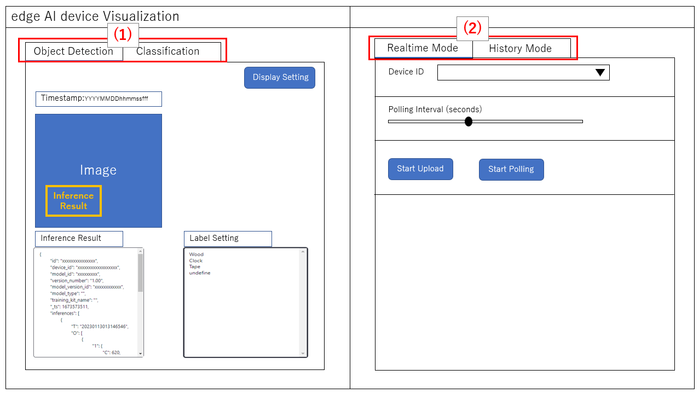
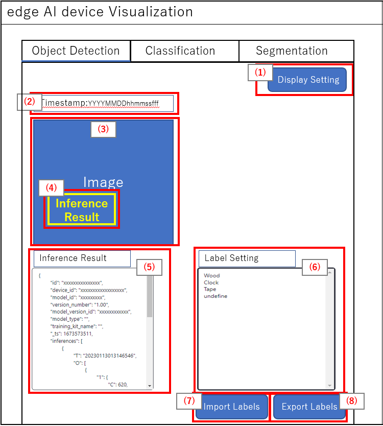
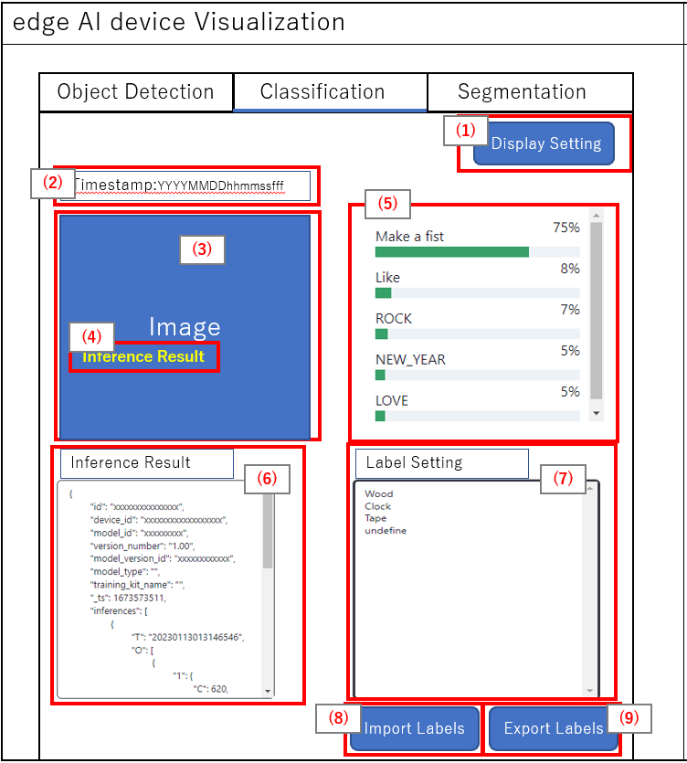
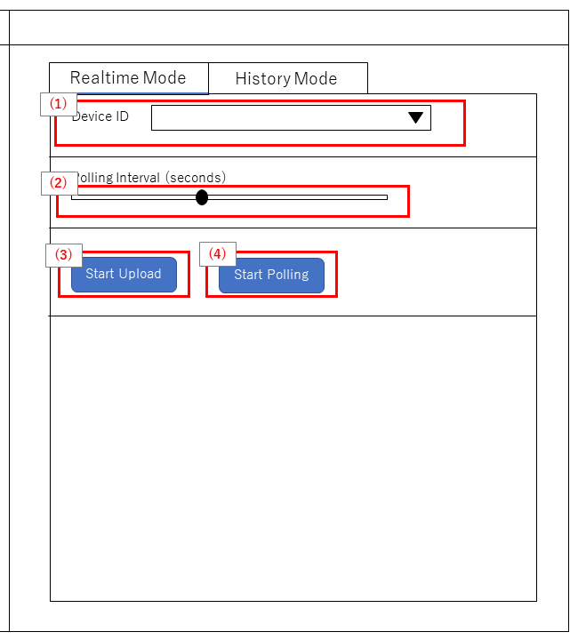
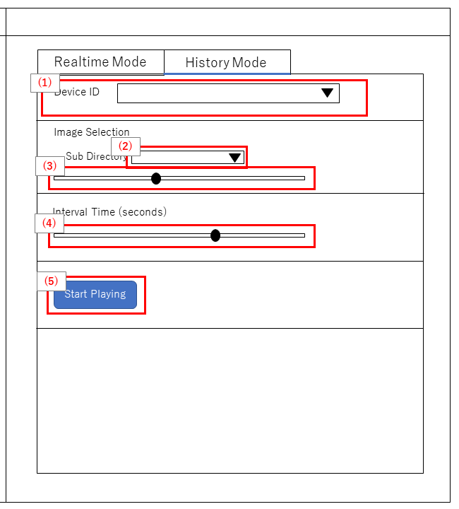
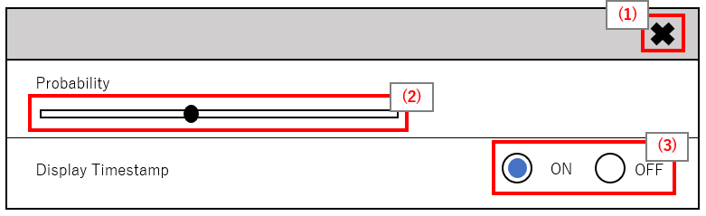
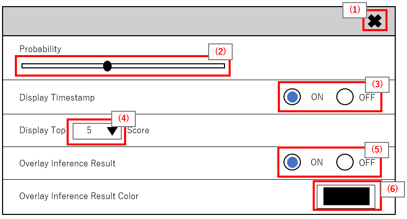

= Cloud SDK pass:[ ] Visualization pass:[ ] Functional Specifications pass:[ ]
:sectnums:
:sectnumlevels: 1
:author: Copyright 2023 Sony Semiconductor Solutions Corporation
:version-label: Version 
:revnumber: x.x.x
:revdate: YYYY - MM - DD
:trademark-desc1: AITRIOS™ and AITRIOS logos are the registered trademarks or trademarks
:trademark-desc2: of Sony Group Corporation or its affiliated companies.
:toc:
:toc-title: TOC
:toclevels: 1
:chapter-label:
:lang: en

== Change history

|===
|Date |What/Why

|2022/11/16
|Initial draft

|2023/1/30
|Updated UI + 
Added support for classification AI task + 
Updated the PDF build environment

|===

== Introduction
* This book is functional specifications of visualization to see inference results. + 
Uses TypeScript for feature development language. + 
Uses Next.js as the application framework.

== Terms/Abbreviations
|===
|Terms/Abbreviations |Meaning

|Console Access Library
|SDK that provides access to the Console for AITRIOS

|Console for AITRIOS (Hereafter referred to as Console)
|A cloud service that provides various functions (Deployment, Retraining, Edge AI Device Management etc.) to efficiently implement solutions from edge to cloud

|Same as return value name
|AI-processed metadata among outputs from Vision and Sensing Applications

|Image
|Image data captured by edge AI devices among outputs from Vision and Sensing Applications
|===

== Reference materials
* Console Access Library for TypeScript used by visualization
** https://github.com/SonySemiconductorSolutions/aitrios-sdk-console-access-lib-ts

* Sample code to deserialize inference results used by visualization
** https://github.com/SonySemiconductorSolutions/aitrios-sdk-deserialization-sample

* Next.js
** https://nextjs.org/

== Expected use case
* Users can launch visualization in the repository to see inference results uploaded by edge AI devices.

== Functional overview/Algorithm
[NOTE]
=== Functional overview
* Realtime Mode
** Get and visualize the latest data.
** Press the Start Upload button to start uploading inference source images/inference results.
** Press the Stop Upload button to stop uploading inference source images/inference results.
** Press the Start Polling button to start getting the latest inference source image/inference results and displaying it on the screen.
*** If the selected AI task is classification, start displaying a list of inference results.
** Press the Stop Polling button to stop getting the latest inference source image/inference results and displaying it to the screen.
*** If the selected AI task is classification, stop displaying a list of inference results.

* History Mode
** Historical data associated with a specified subdirectory can be gotten and visualized.
** Press the Start Playing button to start getting the past inference source images/inference results and displaying it on the screen.
*** If the selected AI task is classification, start displaying a list of inference results.
** Press the Stop Playing button to stop getting the past inference source images/inference results and displaying it to the screen.
*** If the selected AI task is classification, stop displaying a list of inference results.

* It can be run with Docker in Docker.
* It can be run on Codespaces.
* Only object detection and classification are supported as base AI models.

=== Algorithm
. Launch the screen.
.. The main screen appears.
. getDeviceInfo is called to get the Device ID list of edge AI devices registered in the Console.
. The gotten Device ID list of edge AI devices is set to the the drop-down list.
. Set display labels for inference results.
. Open the Display Setting menu and set display setting on the AI task tab

. Realtime Mode
.. Select the Device ID of the edge AI device from the Device ID drop-down list and press Start Upload.
.. startUploadInferenceResult is called to start uploading inference source images and inference results.
.. Set the Polling Interval and press the Start Polling button.
.. getImage and getInference are called periodically to get and display the latest inference source image and inference results.
* If the selected AI task is a classification, a list of inference results is also displayed.
.. When the Stop Upload button is pressed, stopUploadInferenceResult is called to stop uploading inference source images and inference results.
.. Press the Stop Polling button to stop getting and displaying the latest inference source image and inference results.
* If the selected AI task is a classification, the list of inference results is also stopped.

. History Mode
.. Select the Device ID of the edge AI device from the Device ID drop-down list.
.. getSubDirectoryList is called to get a list of subdirectories where the inference source images are stored.
.. The list of gotten sub directories is set in a drop-down list.
.. Select the subdirectory from the Sub Directory drop-down list.
.. getTotalImageCount is called to get the number of inference source images stored in the selected subdirectory.
.. Set the Image Selection/Interval Time and press Start Playing.
.. getImage and getInference are called periodically to get and display the entire number of inference source images and their inference results, one by one, stored in the subdirectory.
* After getting and displaying the last inference source image and inference result of the subdirectory, start again with the first one.
* If the selected AI task is a classification, a list of inference results is also displayed.
.. Pressing the Stop Playing button stops getting and displaying inference source images and inference results.
* If the selected AI task is a classification, the list of inference results is also stopped.

=== Under what condition
* Have access to the Console.
* A TypeScript development environment has been built.
** TypeScript version is 4.7.
** Required if you want to run it as is.
* Docker is available.
** Required if you want to build and use Docker containers.
* An edge AI device is connected to the Console and ready to accept operations from the Console.

=== API
* GET
** {base_url}/api/image/{deviceId}
** {base_url}/api/inference/{deviceId}
** {base_url}/api/subDirectoryList/{deviceId}
** {base_url}/api/totalImageCount/{deviceId}
** {base_url}/api/deviceInfo

* POST
** {base_url}/api/startUploadInferenceResult/{deviceId}
** {base_url}/api/stopUploadInferenceResult/{deviceId}

=== Others exclusive conditions/Specifications
* None

== User interface specifications
=== Screen specifications
:figure-caption: 図

[#_Overview]
==== Overall view of the screen

. AI task tab
* There is a tab for *"Object Detection"* and a tab for *"Classification"*
. Mode tab
* There is a tab for *"Realtime Mode"* and a tab for *"History Mode"*

==== Object Detection tab

. Display Setting menu
** Sets display settings on the AI task tab
. Timestamp of the image file
. Inference source image
. Inference results
. Inference results raw data
** Displayed in JSON format
. Display label settings for inference results
** Displayed in text format

==== Classification tab

. Display Setting menu
** Sets display settings on the AI task tab
. Timestamp of the image file
. Inference source image
. Inference results
** The inference result with the highest score that is greater than or equal to the threshold value set in the Probability slider in the Display Setting menu is displayed.
** If more than one has the same highest score, the first of them is displayed
** Does not display inference results if all scores are 0%
. List of inference results
. Inference results raw data
** Displayed in JSON format
. Display label settings for inference results
** Displayed in text format

==== Realtime Mode tab

. Device ID drop-down list
** Selects the Device ID of the edge AI device registered in the Console
. Polling Interval slider
** Sets the polling interval when getting data from the Console
** The polling interval is displayed numerically to the right of the slider
. Start Upload/Stop Upload button
** Start/Stop uploading images and inference results
. Start Polling/Stop Polling button
** Start/Stop getting and displaying the latest image and inference results from the Console

==== History Mode tab

. Device ID drop-down list
** Selects the Device ID of the edge AI device registered in the Console
. Sub Directory drop-down list
** Selects the subdirectory of images stored in the Console
. Image Selection slider
** Sets the index of the inference source image to start displaying
** The index is displayed numerically to the right of the slider
** When the value of the slider is changed, updates to inference source image with date and time tied to index
. Interval Time slider
** Sets the playing interval when updating inference source images
** The playing interval is displayed numerically to the right of the slider
. Start Playing/Stop Playing button
** Start/Stop updating inference source images

==== Display Setting menu (Object Detection tab)

. Button to close Display Setting menu
. Probability slider
** Sets the confidence threshold to display on the AI task tab
** The threshold is displayed numerically to the right of the slider
. Display Timestamp button
** Show/Hide image file timestamps

==== Display Setting menu (Classification tab)

* 1 ~ 3 is similar to the Display Setting menu in the Object Detection tab

[start=4]
. Display Top Score drop-down list
** Selects the number of items to display in the list of inference results
** The maximum value is 20
. Overlay Inference Result button
** Sets whether to show or hide information with the highest score of the inference result
** Linked to display inference results in the Classification tab
. Overlay Inference Result Color button
** Sets the display color for information with the highest score of the inference result
** Select any color from the color picker

=== Operability specifications
==== Operations until launching visualization
* Clone and use the repository
. Developers open the visualization repository from any browser and clone the repository.
. Install the packages needed for the cloned visualization.
. Launch visualization.

* Build and use Docker containers
. Users open the visualization repository from any browser and clone the repository.
. Launch visualization by executing the following command on a Dockerfile in the repository:
+
....
docker build
....

==== Operations after launch visualization
. After visualization is launched, you are transferred to the main screen.
. Specify any of the tabs [**Object Detection**]/[**Classification**] from the AI task tab.
. Specify any of the tabs [**Realtime Mode**]/[**History Mode**] from the AI task tab.

. Select the AI task
[#_AI Task-operation]
.. On the Object Detection tab
... Open the [**Display Setting**] menu and set the [**Probability**] slider/[**Display Timestamp**].
* The [**Probability**] slider still works during polling/playing.
* If the inference source image is displayed, it works even when stopped.
... Change the display label settings for inference results.
... Timestamp of image file/inference source image/inference results/inference results raw data are displayed according to the operation of Mode tab.
** The inference results are displayed in frames with the label name set on the inference source image.

.. On the Classification tab
... Open the [**Display Setting**] menu and set the [**Probability**] slider/[**Display Timestamp**] button/[**Display Top Score**] drop-down list/[**Overlay Inference Result**] button/[**Overlay Inference Result Color**] button.
* The [**Probability**] slider still works during polling/playing.
* If the inference source image is displayed, it works even when stopped.
... Change the display label settings for inference results.
... Timestamp of image file/inference source image/inference results/list of inference results/inference results raw data are displayed according to the operation of Mode tab.

. Select the mode
[#_Mode-operation]
.. Realtime Mode tab
... Set the[**Device ID**] drop-down list/[**Polling Interval**] slider, and after pressing the [**Start Upload**] button, press the [**Start Polling**] button.
** [**Device ID**] drop-down list/[**Polling Interval**] slider don't work during polling
... Starts getting the specified inference source images/inference results and displays them on the AI task tab.
... After pressing the [**Stop Polling**] button, press the [**Stop Upload**] button.
** Pressing the [**Stop Polling**] button during polling stops only polling. + 
Pressing the [**Stop Upload**] button during polling stops both uploading and polling. 

.. History Mode tab
... Set [**Device ID**] drop-down list/[**Sub Directory**] drop-down list/[**Image Selection**] slider/[**Interval Time**] slider, and press the [**Start Polling**] button.
** The [**Device ID**] drop-down list/[**Sub Directory**] drop-down list/[**Image Selection**] slider/[**Interval Time**] slider don't work during playing.
** Changing the value of the [**Image Selection**] slider during stop playing does not update the inference source image.
... Starts getting the specified inference source images/inference results and displays them on the AI task tab.
... Press the [**Stop Playing**] button

=== API parameters in each block
==== GET

* getImage + 
URL：{base_url}/api/image/{deviceId}?{imagePath}&{numberOfImages}&{skip}&{orderBy}
** Get and return images in the specified imagePath.

|===
|Query Parameter's name|Meaning|Range of parameter

|deviceId
|Device ID of the edge AI device uploading inference source images
|Not specified

|imagePath
|Path on the cloud storage of the inference source image you want to get
|Not specified

|numberOfImages
|Number of inference source images to get
|Not specified

|skip
|Number of inference source images to skip getting
|Not specified

|orderBy
|Sort order by date and time the inference source image was created
|ASC、DESC
|===

|===
|Return value|Meaning

|buff
|Binary data of the gotten inference source image

|timestamp
|Timestamp of the gotten inference source image
|===

* getInference + 
URL : {base_url}/api/inference/{deviceId}?{timestamp}&{aiTask}
** Get a list of inference results linked to inference source images.
*** This API also deserializes inference results

|===
|Query Parameter's name|Meaning|Range of parameter

|deviceId
|Device ID of the edge AI device uploading inference results
|Not specified

|timestamp
|Timestamp taken when saving the inference source image
|Not specified

|aiTask
|Type of AI task selected
|ObjectDetection、Classification
|===

|===
|Return value|Meaning

|inferences list
|List of inference results linked to inference source images
|===

* getSubDirectoryList + 
URL : {base_url}/api/subDirectoryList/{deviceId}
** Get and return a list of subdirectories where inference source images are stored.

|===
|Query Parameter's name|Meaning|Range of parameter

|deviceId
|Device ID of the edge AI device uploading inference source images
|Not specified
|===

|===
|Return value|Meaning

|subDirectory list
|List of subdirectories where inference source images are stored
|===

* getTotalImageCount + 
URL : {base_url}/api/totalImageCount/{deviceId}?{subDirectory}
** Get and return the number of inference source images stored in the selected subdirectory.

|===
|Query Parameter's name|Meaning|Range of parameter

|deviceId
|Device ID of the edge AI device uploading inference source images
|Not specified

|subDirectory
|Sub directory selected from the list
|Not specified
|===

|===
|Return value|Meaning

|total image count
|Number of inference source images stored in the selected subdirectory
|===

* getDeviceInfo + 
URL : {base_url}/api/deviceInfo
** Get the Device ID list of edge AI devices registered in the Console.

|===
|Query Parameter's name|Meaning|Range of parameter

|None
|
|
|===

|===
|Return value|Meaning

|device list
|Device ID list of edge AI devices
|===

==== POST
* startUploadInferenceResult + 
URL : {base_url}/api/startUploadInferenceResult/{deviceId}
** Instructs the Device ID of the selected edge AI device to start uploading inference source images and inference results.
*** This API also gets a list of command parameter files

|===
|Query Parameter's name|Meaning|Range of parameter

|deviceId
|Device ID of the edge AI device to start uploading inference source images and inference results
|Not specified
|===

|===
|Return value|Meaning

|result
|SUCCESS or ERROR string

|outputSubDir
|Directory where images are uploaded
|===

* stopUploadInferenceResult + 
URL : {base_url}/api/stopUploadInferenceResult/{deviceId}
** Instructs the selected edge AI device to stop uploading images and inference results

|===
|Query Parameter's name|Meaning|Range of parameter

|deviceId
|Device ID of the edge AI device to stop uploading inference source images and inference results
|Not specified
|===

|===
|Return value|Meaning

|result
|SUCCESS or ERROR string
|===

== Target performances/Impact on performances
* UI response time of 1.2 seconds or less
* If processing takes more than 5 seconds, then the display during processing can be updated sequentially

== Assumption/Restriction
* The supported AI tasks are "object detection" and "classification".
* Display label settings for inference results are in text format (Refer to the following).

   Label_1
   Label_2
   Label_3

* From the Console UI, set command parameter file to the following setting:
** Mode=1(Image&Inference Result)
** UploadMethodIR="Mqtt"
* If you select an edge AI device that does not have an AI model or application deployed at runtime, it will not work properly.
* If you select an AI task that differs from the output data of the AI model, it may result in an error or incorrect data.

== Remarks
* Image uploads from edge AI devices to the cloud can experience delays of up to several minutes.

== Unconfirmed items
* None
