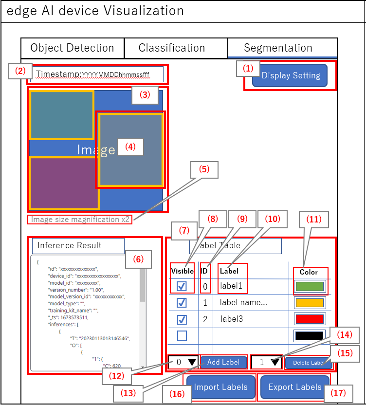
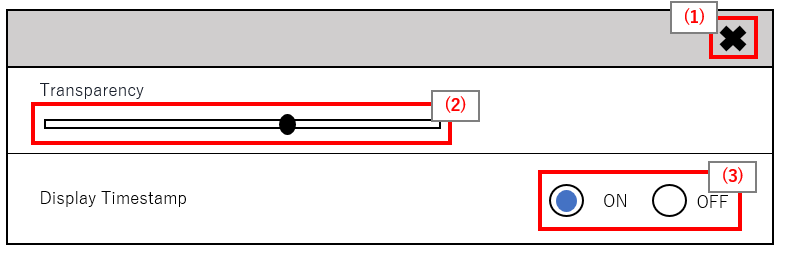
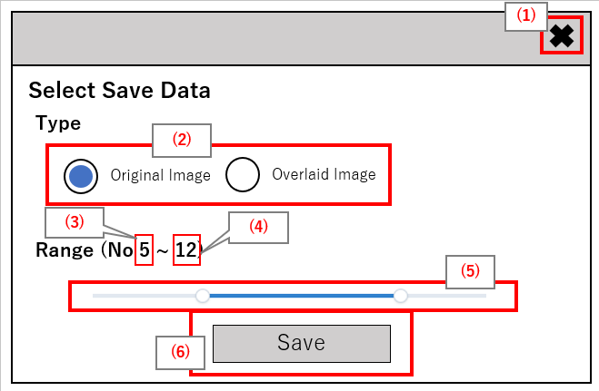
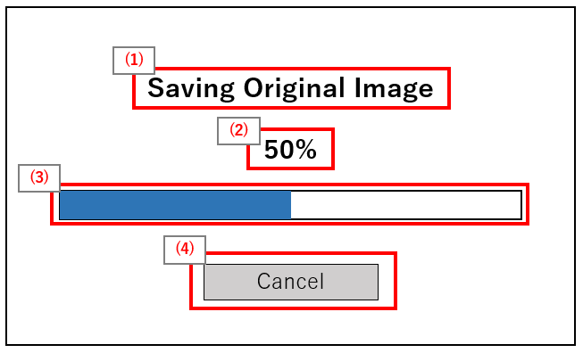

= Cloud SDK pass:[ ] Visualization pass:[ ] Functional Specifications pass:[ ]
:sectnums:
:sectnumlevels: 1
:author: Copyright 2023 Sony Semiconductor Solutions Corporation
:version-label: Version 
:revnumber: x.x.x
:revdate: YYYY - MM - DD
:trademark-desc1: AITRIOS™ and AITRIOS logos are the registered trademarks or trademarks
:trademark-desc2: of Sony Group Corporation or its affiliated companies.
:toc:
:toc-title: TOC
:toclevels: 1
:chapter-label:
:lang: en

== Change history

|===
|Date |What/Why

|2022/11/16
|Initial draft

|2023/1/30
|Updated UI +
Added support for classification AI task +
Updated the PDF build environment

|2023/05/26
|Added support for local saving +
Added support for Device ID retention +
Added support for Segmentation +
Fixed alternate text to images

|2023/06/01
|Changed device ID selection to device name selection

|2023/06/06
|Added support for Docker build +
 Changed wording when there is only one image in subdirectory

|2023/06/20
|Added that the playback order is disturbed by the number of images

|===

== Introduction
* This book is functional specifications of "**Visualization**" to see inference results. + 
Uses TypeScript for feature development language. + 
Uses Next.js as the application framework.

== Terms/Abbreviations
|===
|Terms/Abbreviations |Meaning

|"**Console Access Library**"
|SDK that provides access to the "**Console for AITRIOS**"

|"**Console for AITRIOS**" (Hereafter referred to as "**Console**")
|A cloud service that provides various functions (Deployment, Retraining, Edge AI Device Management etc.) to efficiently implement solutions from edge to cloud

|Same as return value name
|AI-processed metadata among outputs from "**Vision and Sensing Applications**"

|Image
|Image data captured by edge AI devices among outputs from "**Vision and Sensing Applications**"
|===

== Reference materials
* "**Console Access Library**" for TypeScript used by "**Visualization**"
** https://github.com/SonySemiconductorSolutions/aitrios-sdk-console-access-lib-ts

* Sample code to deserialize inference results used by "**Visualization**"
** https://github.com/SonySemiconductorSolutions/aitrios-sdk-deserialization-sample

* Next.js
** https://nextjs.org/

== Expected use case
* Users can launch "**Visualization**" in the repository to see inference results uploaded by edge AI devices.

== Functional overview/Algorithm
[NOTE]
=== Functional overview
* Realtime Mode
** Get and visualize the latest data.
** Press the Reload button to update the Device Name list.
** Press the Start Upload button to start uploading inference source images/inference results.
** Press the Stop Upload button to stop uploading inference source images/inference results.
** Press the Start Polling button to start getting the latest inference source image/inference results and displaying it on the screen.
*** If the selected AI task is classification, start displaying a list of inference results.
** Press the Stop Polling button to stop getting the latest inference source image/inference results and displaying it to the screen.
*** If the selected AI task is classification, stop displaying a list of inference results.

* History Mode
** Historical data associated with a specified subdirectory can be gotten, visualized and saved.
** Press the Reload button to update the Device Name list.
** Press the Start Playing button to start getting the past inference source images/inference results and displaying it on the screen.
*** If the selected AI task is classification, start displaying a list of inference results.
** Press the Stop Playing button to stop getting the past inference source images/inference results and displaying it to the screen.
*** If the selected AI task is classification, stop displaying a list of inference results.
** Press the Save Data button to display the Save Data menu.
*** You can select and save the data you want to save from the Save Data menu.

* It can be run on Codespaces.
* The base AI model supports Object Detection, Classification and Segmentation.

=== Algorithm
. Launch the screen.
.. The main screen appears.
. getDeviceInfo is called to get the Device Name list of edge AI devices registered in the "**Console**".
. The gotten Device Name list of edge AI devices is set to the drop-down list.
. Import/Export label and set display labels for inference results.
.. Only label file data is gotten during label import. (The label file itself is not included.)
. Open the Display Setting menu and set display setting on the AI task tab

. Realtime Mode
.. Select the Device Name of the edge AI device from the Device Name drop-down list and press Start Upload.
.. startUploadInferenceResult is called to start uploading inference source images and inference results.
.. Set the Polling Interval and press the Start Polling button.
.. getImage and getInference are called periodically to get and display the latest inference source image and inference results.
* If the selected AI task is a classification, a list of inference results is also displayed.
.. When the Stop Upload button is pressed, stopUploadInferenceResult is called to stop uploading inference source images and inference results.
.. Press the Stop Polling button to stop getting and displaying the latest inference source image and inference results.
* If the selected AI task is a classification, the list of inference results is also stopped.

. History Mode
.. Select the Device Name of the edge AI device from the Device Name drop-down list.
.. getSubDirectoryList is called to get a list of subdirectories where the inference source images are stored.
.. The list of gotten subdirectories is set in a drop-down list.
.. Select the subdirectory from the Sub Directory drop-down list.
.. getTotalImageCount is called to get the number of inference source images stored in the selected subdirectory.
.. Set the Image Selection/Interval Time and press Start Playing.
.. getImage and getInference are called periodically to get and display the entire number of inference source images and their inference results, one by one, stored in the subdirectory.
* After getting and displaying the last inference source image and inference result of the subdirectory, start again with the first one.
* If the selected AI task is a classification, a list of inference results is also displayed.
.. Pressing the Stop Playing button stops getting and displaying inference source images and inference results.
* If the selected AI task is a classification, the list of inference results is also stopped.
.. Press the Save Data button to open the Save Data menu.
.. Select the data format you want to save from the Select Save Data radio button.
.. Move the Save Range slider to specify the range to save data.
.. Press the Save button.
.. The "Save File As" dialog appears.
* The user can select the name and destination of the file to be saved.
.. When the user selects a filename and destination to save and presses the "Save" button, the Saving dialog appears, displaying the format of the data to be saved, the progress of saving it, and the save progress bar.
* The save progress and save progress bar are updated from time to time.
* The progress at the time of saving is as follows:
** Starts saving: 0%
** Working directory creation and initialization complete: 20%
** Get and save inference source images complete: 50%
** Generating overlaid images: 60%
** Get, deserialize, and save inference results complete: 80%
** Generating zip file and getting zip data are complete: 100%

* You can cancel the save by pressing the Cancel button.
.. initializeDirectory is called to create a working directory for data saving.
** Creates the working directory under the name "work" under the src directory.
.. saveImage and saveInferences are called to save the specified range of inference source images and inference results to the working directory.
.. If you select Overlaid Image: + 
createOverlaidImage is called to create and save images by overlaying inference results/timestamp on the inference source images saved in the working directory. Overlaid images are created that reflects the label and Display Setting values set when the Save Data button is pressed.
.. createZip is called to create a zip file containing the saved inference source images and inference results in the working directory.
.. getZipData is called to get the data of the created zip file.
** The file structure of the zip file is as follows.
        
   yyyyMMddHHmmssSSS (1)      
      ∟yyyyMMddHHmmssSSS.jpg (2)
      ∟yyyyMMddHHmmssSSS.jpg (2)
      ∟yyyyMMddHHmmssSSS.json (3)
      ∟yyyyMMddHHmmssSSS.json (3)

   (1) Inference start time
   (2) Original Image: Inference source image file, Overlaid Image: Overlaid image file (The filename is the time at which the inference source image was output)
   (3) Inference results file (The filename is the time at which the inference source image was output)

.. Once the data is gotten, it is written to a user-specified destination file.
.. Once the data is written, the save progress is 100% and the save is complete.
** The data saved in the working directory is deleted when the working directory is initialized after the next saving process is started.
** The saved data that remains when the saving is canceled is similarly deleted when the working directory is initialized after the next saving process is started.

=== Under what condition
* Have access to the "**Console**".
* A development environment with Node.js has been built.
** Version of Node.js is v16.
* A TypeScript development environment has been built.
** TypeScript version is 4.7.
** Required if you want to run it as is.
* Docker is available.
** Required if you want to build and use Docker containers.
* An edge AI device is connected to the "**Console**" and ready to accept operations from the "**Console**".

=== API
* GET
** {base_url}/api/image/{deviceId}
** {base_url}/api/inference/{deviceId}
** {base_url}/api/subDirectoryList/{deviceId}
** {base_url}/api/totalImageCount/{deviceId}
** {base_url}/api/deviceInfo
** {base_url}/api/getZipData

* POST
** {base_url}/api/startUploadInferenceResult/{deviceId}
** {base_url}/api/stopUploadInferenceResult/{deviceId}
** {base_url}/api/initializeDirectory/{deviceId}
** {base_url}/api/saveImage/{deviceId}
** {base_url}/api/saveInferences/{deviceId}
** {base_url}/api/createZip
** {base_url}/api/createOverlaidImage/{deviceId}

=== Others exclusive conditions/Specifications
* None

== User interface specifications
=== Screen specifications
:figure-caption: 図

[#_Overview]
==== Overall view of the screen
image::./ScreenSpec_Visualization_OverView.png["Overall view of the screen"]

. AI task tab
* There is a tab for *"Object Detection"*, a tab for *"Classification"* and a tab for *"Segmentation"*
. Mode tab
* There is a tab for *"Realtime Mode"* and a tab for *"History Mode"*

==== Object Detection tab
image::./ScreenSpec_Visualization_ObjectDetection.png[alt="Object Detection tab", width="700"]

. Display Setting menu
** Sets display settings on the AI task tab
. Timestamp of the image file
. Inference source image
. Inference results
. Inference results raw data
** Displayed in JSON format
. Display label settings for inference results
** Displayed in JSON format
** Users can edit labels
. Import Labels button
** Imports any label file and displays it in the label settings for inference results
** The format of the label file is described in the "Example for Object Detection/Classification" under "Assumption/Restriction"
. Export Labels button
** Exports data in the display label settings for inference results as a label file
** Label file is saved anywhere on the user PC
** The format of the label file is described in the "Example for Object Detection/Classification" under "Assumption/Restriction"

==== Classification tab
image::./ScreenSpec_Visualization_Classification.png[alt="Classification tab", width="700"]

. Display Setting menu
** Sets display settings on the AI task tab
. Timestamp of the image file
. Inference source image
. Inference results
** The inference result with the highest score that is greater than or equal to the threshold value set in the Probability slider in the Display Setting menu is displayed.
** If more than one has the same highest score, the first of them is displayed
** Does not display inference results if all scores are 0%
. List of inference results
. Inference results raw data
** Displayed in JSON format
. Display label settings for inference results
** Displayed in JSON format
** Users can edit labels

[stert=0]
* 8 and 9 are similar to the Import Labels button/Export Labels button on the Object Detection tab

==== Segmentation tab

. Display Setting menu
** Sets display settings on the AI task tab
. Timestamp of the image file
. Inference source image
** Inference source images of Semantic Segmentation are displayed at twice its original size
. Inference results
** Detects objects pixel by pixel and displays the detection in any color
. Magnification of the inference source images
** Displays magnification of Semantic Segmentation inference source images
. Inference results raw data
** Displayed in JSON format
. Label table
** Manages and displays inference result label information
** Each label has one row of data in the label table
** There are four items defined for label data: **"Visible"**、**"ID"**、**"Label"**、**"Color"** 
** Labels are displayed in order of class ID
. Checkbox to display/hide inference results (**"Visible"**)
** Displays/Hides the label
. Class ID (**"ID"**)
** Displays the class ID of the displayed label
. Label (**"Label"**)
** Users can edit labels
** If the label is too long, the end is omitted with "..."
. Color picker (**"Color"**)
** Changes the color of inference results
. Label addition position drop-down
** Specifies where to add a label to the label table
** The setting range is 0 to the final ID of the label table + 1, and the maximum value is the final ID of the label table + 1
. Add Label button
** Adds a row (all columns) at a user-specified position in the label table
** The initial value when adding a row is as follows:
*** **"Visible"** ：Checked
*** **"ID"** ：Number of the row added
*** **"Label"** ：No initial value, "Label Name" is displayed as a placeholder
*** **"Color"** ：#FFFFFF
. Label deletion position drop-down
** Specifies where to delete a label in the label table
** The setting range is 0 to the final ID of the label table, and the maximum value is the final ID of the label table
. Delete Label button
** Deletes a row (all columns) at a user-specified position in the label table
. Import Labels button
** Imports any label file and sets it to a label table
** The format of the label file is described in the "Example for Segmentation" under "Assumption/Restriction"
. Export Labels button
** Exports data currently set in the label table as a label file
** Saves the label file anywhere on the user PC
** The format of the label file is described in the "Example for Segmentation" under "Assumption/Restriction"

==== Realtime Mode tab
image::./ScreenSpec_Visualization_RealtimeMode.png[alt="Realtime Mode tab", width="700"]

. Device Name drop-down list
** Selects the Device Name of the edge AI device registered in the "**Console**"
+
If a string is set that exceeds the length of the Device Name text box, the excess is omitted to "..."
. Reload button
** Updates the Device Name list in the Device Name drop-down list to the Device Name list of the latest Edge AI device registered in "**Console**"
** After reload, the Device Name drop-down list is left with no Device Name selected
. Polling Interval slider
** Sets the polling interval when getting data from the "**Console**"
** The polling interval is displayed numerically to the right of the slider
. Start Upload/Stop Upload button
** Starts/Stops uploading images and inference results
. Start Polling/Stop Polling button
** Starts/Stops getting and displaying the latest image and inference results from the "**Console**"

==== History Mode tab
image::./ScreenSpec_Visualization_HistoryMode.png[alt="History Mode tab", width="700"]

. Device Name drop-down list
** Selects the Device Name of the edge AI device registered in the "**Console**"
. Reload button
** Updates the Device Name list in the Device Name drop-down list to the Device Name list of the latest Edge AI device registered in "**Console**"
** After reload, the Device Name drop-down list is left with no Device Name selected
. Sub Directory drop-down list
** Selects the subdirectory of images stored in the "**Console**"
. Image Selection slider
** Sets the index of the inference source image to start displaying
** The index is displayed numerically to the right of the slider
** When the value of the slider is changed, updates to inference source image with date and time tied to index
. Interval Time slider
** Sets the playing interval when updating inference source images
** The playing interval is displayed numerically to the right of the slider
. Start Playing/Stop Playing button
** Starts/Stops updating inference source images
. Save Data button
** Displays the Save Data menu

==== Display Setting menu (Object Detection tab)
image::./ScreenSpec_Visualization_SettingMenu_ObjectDetection.png["Display Setting menu (Object Detection tab)"]

. Button to close Display Setting menu
. Probability slider
** Sets the probability threshold to display on the AI task tab
** The threshold is displayed numerically to the right of the slider
. Display Timestamp button
** Displays/Hides image file timestamps

==== Display Setting menu (Classification tab)
image::./ScreenSpec_Visualization_SettingMenu_Classification.png["Display Setting menu (Classification tab)"]

* 1 ~ 3 is similar to the Display Setting menu in the Object Detection tab

[start=4]
. Display Top Score drop-down list
** Selects the number of items to display in the list of inference results
** The maximum value is 20
. Overlay Inference Result button
** Sets whether to display or hide information with the highest score of the inference result
** Linked to display inference results in the Classification tab
. Overlay Inference Result Color button
** Sets the display color for information with the highest score of the inference result
** Selects any color from the color picker

==== Display Setting menu (Segmentation tab)

. Button to close Display Setting menu
. Transparency slider
** Sets the transparency of the inference results to display
** Transparency is indicated by % on the right side of the slider
. Display Timestamp button
** Displays/Hides image file timestamps

==== Save Data menu

. Save Data menu close button
. Type radio button
** Selects data to save
*** Original Image saves inference source images without inference results overlay, and inference result raw data
*** Overlaid Image saves inference results/timestamp-overlaid images and inference result raw data
. Start index
** Specifies the start index to save inference source images in a specified subdirectory
** It works with the left knob of the range slider
** Not displayed when there is only one image (including parentheses, letters in parentheses)
. End index
** Specifies the end index to save inference source images in a specified subdirectory
** It works with the right knob of the range slider
** Not displayed when there is only one image (including parentheses, letters in parentheses)
. Range slider
** Specifies the range to save inference source images in a specified subdirectory
** If there is only one image, the Range slider is not displayed and the message "Only one item can be saved" is displayed

. Save button
** Starts saving specified data
** Saves images and inference results from specified subdirectory in zip format anywhere on the user PC

==== Saving dialog

. Save data format
** Displays save data format
*** Displays **"Saving Original Image"** if the data being saved is Original Image
*** Displays **"Saving Overlaid Image"** if the data being saved is Overlaid Image
. Save progress
** Displays save progress as a percentage
. Save progress bar
** Displays save progress in progress bar
. Cancel button
** Cancels saving data

=== Operability specifications
==== Operations until launching "**Visualization**"
* Use "**Visualization**" in a Docker container
. Developers open the "**Visualization**" repository from any browser and clone the repository.
. Create a "**Visualization**" Docker image by executing the following command on a Dockerfile directly under the repository root directory:
+
....
docker build . -t visualization-app
....
. Launch "**Visualization**" by executing the following command:
+
....
docker run -p 3000:3000 -d visualization-app
....

* How to launch in other environments
. Launch terminal in Codespaces or a directory cloned from the **Visualization** repository
. Run the following command to install the packages needed for the cloned "**Visualization**": (No need for Codespaces since they are automatically installed)
** If the error "npm ERR! gyp ERR! build error" occurs when running the following command, install the C++ compiler.
+
....
npm install
....
. Run the following command in the terminal to launch "**Visualization**":
+
....
npm run dev
....

==== Operations after launch "**Visualization**"
. After "**Visualization**" is launched, you are transferred to the main screen.
. Specify any of the tabs [**Object Detection**]/[**Classification**]/[**Segmentation**] from the AI task tab.
. If necessary, press the [**Import Labels**] to import labels.
. Specify any of the tabs [**Realtime Mode**]/[**History Mode**] from the AI task tab.

. Select the AI task
[#_AI Task-operation]
.. On the Object Detection tab
... Open the [**Display Setting**] menu and set the [**Probability**] slider/[**Display Timestamp**].
* The [**Probability**] slider still works during polling/playing.
* If the inference source image is displayed, it works even when stopped.
... Change the display label settings for inference results.
... Timestamp of image file/inference source image/inference results/inference results raw data are displayed according to the operation of Mode tab.
** The inference results are displayed in frames with the label name set on the inference source image.

.. On the Classification tab
... Open the [**Display Setting**] menu and set the [**Probability**] slider/[**Display Timestamp**] button/[**Display Top Score**] drop-down list/[**Overlay Inference Result**] button/[**Overlay Inference Result Color**] button.
* The [**Probability**] slider still works during polling/playing.
* If the inference source image is displayed, it works even when stopped.
... Change the display label settings for inference results.
... Timestamp of image file/inference source image/inference results/list of inference results/inference results raw data are displayed according to the operation of Mode tab.

.. On the Segmentation tab
... Open the [**Display Setting**] menu and set the [**Transparency**] slider/[**Display Timestamp**] button.
* The [**Transparency**] slider still works during polling/playing.
... Change the display label settings for inference results from the label table.
.... Set whether to display or hide inference results in the [**Visible**].
.... Set any label in the [**Label**].
.... Set any display color of inference results in the [**Color**].
.... Select a label addition position from the label addition position drop-down and press the [**Add Label**] to add label data.
* If the inference source image is displayed, it works even when stopped.
.... Select a label deletion position from the label deletion position drop-down and press the [**Delete Label**] to delete the label data.
* If the inference source image is displayed, it works even when stopped.
... Timestamp of image file/inference source image/inference results/inference results raw data are displayed according to the operation of Mode tab.

. Select the mode
[#_Mode-operation]
.. Realtime Mode tab
** Press the [**Reload**] button to update [**Device Name**] drop-down list.
** The [**Device Name**] drop-down list/[**Reload**] button/[**Polling Interval**] slider don't work during polling
... Starts getting the specified inference source images/inference results and displays them on the AI task tab.
... After pressing the [**Stop Polling**] button, press the [**Stop Upload**] button.
** Pressing the [**Stop Polling**] button during polling stops only polling. + 
Pressing the [**Stop Upload**] button during polling stops both uploading and polling. 

.. History Mode tab
... Set [**Device Name**] drop-down list/[**Sub Directory**] drop-down list/[**Image Selection**] slider/[**Interval Time**] slider, and press the [**Start Polling**] button.
** Press the [**Reload**] button to update [**Device Name**] drop-down list.
** The [**Device Name**] drop-down list/[**Reload**] button/[**Sub Directory**] drop-down list/[**Image Selection**] slider/[**Interval Time**] slider don't work during playing.
** Changing the value of the [**Image Selection**] slider during stop playing does not update the inference source image.
... Starts getting the specified inference source images/inference results and displays them on the AI task tab.
... Press the [**Stop Playing**] button.
... Press the [**Save Data**] button.
** The Save Data menu appears.
... Select the data to save from the [**Select Save Data**] radio button.
... Specify the range to save inference source images in a subdirectory from the [**Save Range**] slider.
... Press the [**Save**] button.
... Enter a save filename to the "Save File As" dialog, specify any directory, and press the "Save" button.
** The Saving dialog menu appears.
... Format of the data being saved, save progress, save progress bar, and [**Cancel**] button appear in the Saving dialog.
** Press the [**Cancel**] to cancel saving.
. If necessary, press the [**Export Labels**] to export labels.
** Enter a save filename to the "Save File As" dialog, specify any directory, and press the "Save" button.

=== API parameters in each block
==== GET

* getImage + 
URL：{base_url}/api/image/{deviceId}?{imagePath}&{numberOfImages}&{skip}&{orderBy}
** Get and return images in the specified imagePath.

|===
|Query Parameter's name|Meaning|Range of parameter

|deviceId
|Device ID of the edge AI device uploading inference source images
|Not specified

|imagePath
|Path on the cloud storage of the inference source image you want to get
|Not specified

|numberOfImages
|Number of inference source images to get
|Not specified

|skip
|Number of inference source images to skip getting
|Not specified

|orderBy
|Sort order by date and time the inference source image was created
|ASC, DESC
|===

|===
|Return value|Meaning

|buff
|Binary data of the gotten inference source image

|timestamp
|Timestamp of the gotten inference source image
|===

* getInference + 
URL : {base_url}/api/inference/{deviceId}?{timestamp}&{aiTask}
** Get a list of inference results linked to inference source images.
*** This API also deserializes inference results.

|===
|Query Parameter's name|Meaning|Range of parameter

|deviceId
|Device ID of the edge AI device uploading inference results
|Not specified

|timestamp
|Timestamp taken when saving the inference source image
|Not specified

|aiTask
|Type of AI task selected
|ObjectDetection、Classification、Segmentation
|===

|===
|Return value|Meaning

|inferences list
|List of inference results linked to inference source images
|===

* getSubDirectoryList + 
URL : {base_url}/api/subDirectoryList/{deviceId}
** Get and return a list of subdirectories where inference source images are stored.

|===
|Query Parameter's name|Meaning|Range of parameter

|deviceId
|Device ID of the edge AI device uploading inference source images
|Not specified
|===

|===
|Return value|Meaning

|subDirectory list
|List of subdirectories where inference source images are stored
|===

* getTotalImageCount + 
URL : {base_url}/api/totalImageCount/{deviceId}?{subDirectory}
** Get and return the number of inference source images stored in the selected subdirectory.

|===
|Query Parameter's name|Meaning|Range of parameter

|deviceId
|Device ID of the edge AI device uploading inference source images
|Not specified

|subDirectory
|Subdirectory selected from the list
|Not specified
|===

|===
|Return value|Meaning

|total image count
|Number of inference source images stored in the selected subdirectory
|===

* getDeviceInfo + 
URL : {base_url}/api/deviceInfo
** Get the Device Name and Device ID list of edge AI devices registered in the "**Console**".

|===
|Query Parameter's name|Meaning|Range of parameter

|None
|
|
|===

|===
|Return value|Meaning

|device list
|Device Name and Device ID list of edge AI devices
|===

* getZipData + 
URL : {base_url}/api/getZipData
** Get the zip file data generated by createZip.

|===
|Query Parameter's name|Meaning|Range of parameter

|None
|
|
|===

|===
|Return value|Meaning

|zipData
|zip file data to save
|===

==== POST
* startUploadInferenceResult + 
URL : {base_url}/api/startUploadInferenceResult/{deviceId}
** Instructs the Device ID corresponding to the Device Name of the selected edge AI device to start uploading inference source images and inference results.
*** This API also gets a list of command parameter files

|===
|Query Parameter's name|Meaning|Range of parameter

|deviceId
|Device ID of the edge AI device to start uploading inference source images and inference results
|Not specified
|===

|===
|Return value|Meaning

|result
|SUCCESS or ERROR string

|outputSubDir
|Directory where images are uploaded
|===

* stopUploadInferenceResult + 
URL : {base_url}/api/stopUploadInferenceResult/{deviceId}
** Instructs the Device ID corresponding to the Device Name of the selected edge AI device to stop uploading images and inference results.

|===
|Query Parameter's name|Meaning|Range of parameter

|deviceId
|Device ID of the edge AI device to stop uploading inference source images and inference results
|Not specified
|===

|===
|Return value|Meaning

|result
|SUCCESS or ERROR string
|===

*  initializeDirectory + 
URL : {base_url}/api/initializeDirectory/{deviceId}?{subDirectory}
** Creates and initializes a working directory to save data.

|===
|Query Parameter's name|Meaning|Range of parameter

|deviceId
|Device ID of the edge AI device uploading inference source images
|Not specified

|subDirectory
|Subdirectory where data is stored
|Not specified
|===

|===
|Return value|Meaning

|None
|
|===

*  saveImage + 
URL : {base_url}/api/saveImage/{deviceId}?{subDirectory}?{startIndex}?{endIndex}
** Saves images from the subdirectory selected by the user.

|===
|Query Parameter's name|Meaning|Range of parameter

|deviceId
|Device ID of the edge AI device uploading inference source images
|Not specified

|subDirectory
|Subdirectory where data is stored
|Not specified

|startIndex
|The start index to save inference source images in subdirectory
|Not specified

|endIndex
|The end index to save inference source images in subdirectory
|Not specified
|===

|===
|Return value|Meaning

|None
|
|===

*  saveInferences + 
URL : {base_url}/api/saveInferences/{deviceId}?{subDirectory}?{aiTask}
** Saves the inference results associated with the images in the subdirectory selected by the user.

|===
|Query Parameter's name|Meaning|Range of parameter

|deviceId
|Device ID of the edge AI device uploading inference source images
|Not specified

|subDirectory
|Subdirectory where data is stored
|Not specified

|aiTask
|Type of AI task selected
|ObjectDetection、Classification、Segmentation
|===

|===
|Return value|Meaning

|None
|
|===

*  createZip + 
URL : {base_url}/api/createZip
** Creates a zip file containing the inference source images and inference results stored in the working directory.
|===
|Query Parameter's name|Meaning|Range of parameter

|None
|
|
|===

|===
|Return value|Meaning

|None
|
|===

*  createOverlaidImage + 
URL : {base_url}/api/createOverlaidImage/{deviceId} +
** Saves images by overlaying inference results/timestamp on the inference source images saved in the working directory.
|===
|Query Parameter's name|Meaning|Range of parameter

|deviceId
|Device ID of the edge AI device uploading inference source images
|Not specified
|===

|===
|Request Body's name|Meaning|Range of parameter

|subDirectory
|Subdirectory where data is stored
|Not specified

|aiTask
|Type of AI task selected
|ObjectDetection、Classification、Segmentation

|isDisplayTs
|Displays/Hides timestamps
|true, false

|labelData
|Inference results display label set +
*Use only for Object Detection, Classification
|Not specified

|probability
|Probability threshold to display +
*Use only for Object Detection, Classification
|0~100

|isOverlayIR
|Displays/Hides information with the highest score of the inference result +
*Use only for Classification
|true, false

|overlayIRC
|Display color for information with the highest score of the inference result +
*Use only for Classification
|Not specified

|labelListData
|List of inference results display label set +
*Use only for Segmentation
|Not specified

|transparency
|Transparency of inference results +
*Use only for Segmentation
|0~100

|===

|===
|Return value|Meaning

|None
|
|===

== Target performances/Impact on performances
* UI response time of 1.2 seconds or less
* If processing takes more than 5 seconds, then the display during processing can be updated sequentially

== Assumption/Restriction
* Semantic Segmentation is the only type of Segmentation supported this time.
* Display label settings for inference results are in the following JSON format (Refer to the following example).
** If the key name is different from the example, an error occurs during import.
** Labels must be in the order of class ID as detected by the AI model.
** Example for Object Detection/Classification

   {
      "label": [
         "Label_1",
         "Label_2",
         "Label_3"
      ]
   }

** Example for Segmentation

   {
      "labelList": [
         {
           "isVisible": true,
           "label": "Label_1",
           "color": "#000000"
         },
         {
           "isVisible": false,
           "label": "Label_2",
           "color": "#0000ff"
         },
         {
           "isVisible": true,
           "label": "Label_3",
           "color": "#ff0000"
         }
      ]
   }

* From the "**Console**" UI, set command parameter file to the following setting:
** Mode=1(Image&Inference Result)
** UploadMethodIR="Mqtt"
** Other parameters need to be changed depending on the AI model and application content.
* If you select an edge AI device that does not have an AI model or application deployed at runtime, it will not work properly.
* If you select an AI task that differs from the output data of the AI model, it may result in an error or incorrect data.
* If there are more than 1000 images in a subdirectory in History Mode or Realtime Mode, the playback order of the images may be disturbed.

== Remarks
* Image uploads from edge AI devices to the "**Console**" can experience delays of up to several minutes.

== Unconfirmed items
* None
