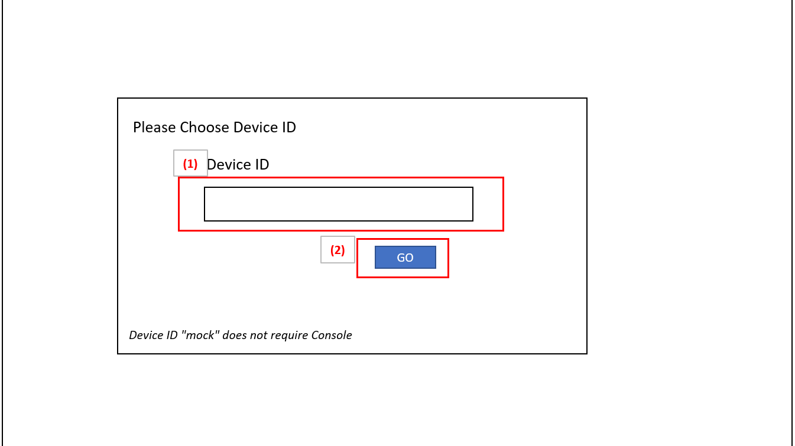
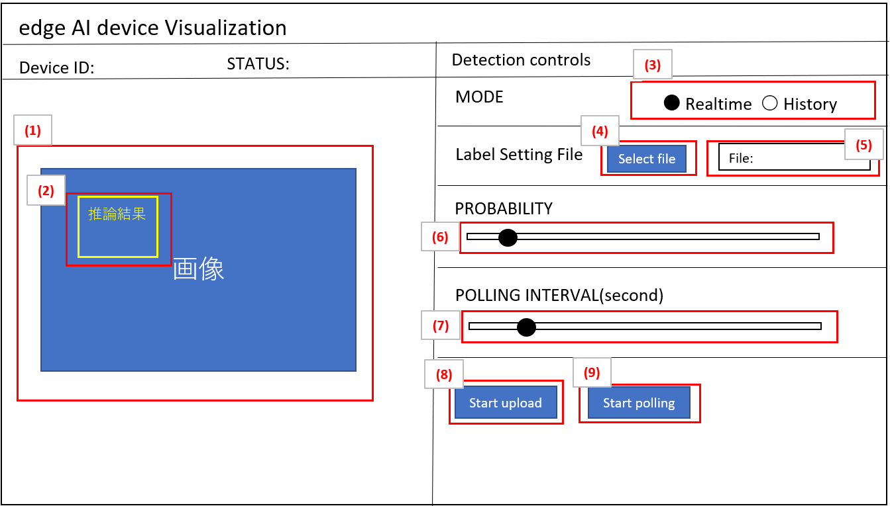
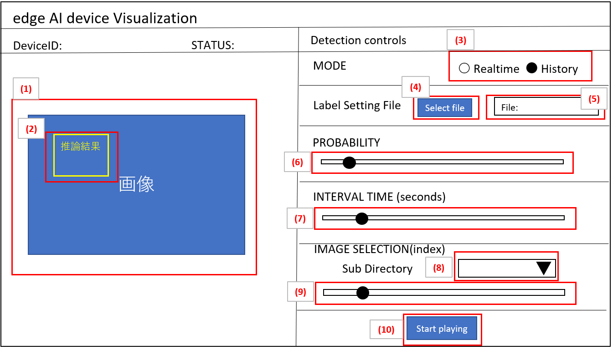

= Cloud SDK pass:[ ] Visualization pass:[ ] 機能仕様書 pass:[ ]
:title-page-background-image: image:../../../images/Trademark.png[fit=none,pdfwidth=50%,position=bottom center]
:sectnums:
:sectnumlevels: 4
:chapter-label:
:author: Copyright 2022 Sony Semiconductor Solutions Corporation
:revdate: 2022 - xx - xx
:revnumber: 0.0.x
:toc:
:toc-title: 目次
:toclevels: 4
:chapter-label:
:document-title-header:
:lang: ja

== 更新履歴

|===
|Date |What/Why

|2022/11/16
|初版作成

|===

== はじめに

* 本書は、推論結果を確認するためのVisualizationについての機能仕様である。機能開発言語には、TypeScriptを使用する。アプリケーションフレームワークはNext.jsを使用する。

== 用語・略語
|===
|Terms/Abbreviations |Meaning

|Console Access Library
|Console for AITRIOSへのアクセス方法を提供するSDK

|Console for AITRIOS
|エッジからクラウドを含めたソリューションを効率的に導入するための各種機能（デプロイメント機能、リトレーニング機能、デバイスマネジメント機能など）を提供するクラウドサービス

|推論結果
|Vision and Sensing Applicationからの出力のうち、AI処理されたメタデータ

|画像
|Vision and Sensing Applicationからの出力のうち、エッジAIデバイスがとらえているイメージデータ

|===

== 参照資料
* Visualizationで利用するTypeScript版Console Access Library
** https://github.com/SonySemiconductorSolutions/aitrios-sdk-console-access-lib-ts
* Visualizationで利用する推論結果Deserializeサンプルコード
** https://github.com/SonySemiconductorSolutions/aitrios-sdk-deserialization-sample
* Next.js
** https://nextjs.org/

== 想定ユースケース
* ユーザーはリポジトリ内のVisualizationを起動することで、エッジAIデバイスがUploadした推論結果の確認ができる。

== 機能概要、アルゴリズム
[NOTE]
=== Functional Overview
* Device IDを選択することで、メイン画面が表示される。
* RealtimeModeとHistoryModeの切り替えができる。
* RealtimeMode
** 最新データを取得、表示、保存できる。
** Start Uploadボタンを押下することで、画像/推論結果のアップロードを開始する。
** Stop Uploadボタンを押下することで、画像/推論結果のアップロードを停止する。
** Start Pollingボタンを押下することで、最新の画像/推論結果の取得、保存、画面表示を開始する。
** Stop Pollingボタンを押下することで、最新の画像/推論結果の取得、保存、画面表示を停止する。
* HistoryMode
** 指定したサブディレクトリに紐づく過去のデータを取得、表示、保存できる。
** Start Playingボタンを押下することで、過去の画像/推論結果の取得、保存、画面表示を開始する。
** Stop Playingボタンを押下することで、過去の画像/推論結果の取得、保存、画面表示を停止する。
* 任意のLabel名設定用ファイルを設定できる。※Label名設定用ファイルの詳細は制限事項に記載
* Docker in Docker で動かすことができる。
* Codespaces で動かすことができる。
* ベースAIモデルはObject Detectionのみ対応する。

=== Algorithm
. 画面を起動する。
.. Device IDを入力する。
. メイン画面に移行する。
.. モードを選択する。（RealtimeMode/HistoryMode）。
.. Label名設定用ファイルを設定する。（指定なしの場合デフォルトのファイルが適用される）
. RealtimeModeの場合
.. Probabilityを設定し、Start Uploadを押下する。
.. startuploadinferenceresultが呼び出され、推論結果と画像のアップロードが開始される。
.. Polling Intervalを設定し、Start Pollingボタンを押下する。
.. getImageData,getLatestInferenceDataが定期呼び出しされ、最新の推論結果と画像を取得し、Visualizationが動作しているフォルダに保存する。
.. 取得した画像と推論結果は画面に表示される。
.. Stop Uploadボタンを押下すると、stopuploadinferenceresultが呼び出され、推論結果と画像のアップロードが停止される。
.. Stop Pollingボタンを押下すると、最新の推論結果と画像の取得、保存、表示が停止される。
. HistoryModeの場合
.. History Mode画面に遷移後、Consoleに保存済のDevice IDに紐づく推論結果をすべて取得する。
.. getImageListを呼び出し、取得したサブディレクトリ一覧からプルダウンを作成する。
.. Probability/IntervalTime/SubDirectoryを設定し、Start Playingを押下する。
.. 指定したSubDirectoryを引数に取るgetImageListが呼び出しされ、既にConsoleに格納されている画像を取得する。
.. 取得した画像と推論結果を、Visualizationが動作しているフォルダに保存し、保存された画像群をもとに、画像名リストを作成する。
* 保存ディレクトリはRealtimeModeと同様の構成とする。
.. 画像名リストから取得（保存）された画像の総数を算出し、ImageSelectionを選択できるようにする。
.. getInferenceDataを呼び出し、取得された画像に紐づく推論結果を取得する。
.. Localに保存された画像データを取得し、推論結果と合わせて画面に表示される。
.. Stop Playingボタンを押下すると、推論結果と画像の表示が停止される。

=== Under what condition
* Consoleへのアクセスができること。
* TypeScriptの開発環境が構築されていること。
** TypeScriptのversionは4.7。
** そのまま実行する場合に必要である。
* Dockerが利用可能であること。
** Dockerコンテナをビルドして利用する場合に必要である。
* エッジAIデバイスがConsoleに接続されており、Consoleからの操作を受けつける状態である。

=== API
* GET
** {base_url}/api/image/imagepath
** {base_url}/api/imagelist/deviceID?[uploadSubDirectory]
** {base_url}/api/inference/deviceID/selector
** {base_url}/api/labels
** {base_url}/api/startuploadinferenceresult/deviceID
** {base_url}/api/stopuploadinferenceresult/deviceID
** {base_url}/api/deviceinfo/deviceID

=== Others Exclusive conditions / specifications
* なし

== 操作性仕様、画面仕様
=== 画面仕様
:figure-caption: 図

[#_Input-DeviceID]
==== Device ID入力画面

. 推論結果を確認したい *"Device ID"* を入力して設定する。
.  *"Device ID"* を確定し結果確認画面に遷移する。
..  *"Device ID"* に *"mock"* と入力した場合、Consoleへは接続せず、Visualizationがダミー動作をする。

==== RealtimeMode画面

STATUSの表示は下記の通りとする。
|===
||Polling中|Polling停止中

|Upload中
|Uploading / Polling
|Uploading / Not polling
|Upload停止中
|Not Uploading / Polling
|Not Uploading / Not polling

|===

. クラウドから取得した最新画像
. クラウドから取得した最新推論結果
. モードを切り替える
. Label名設定用ファイルを選択するボタン（エクスプローラーが表示）
** 指定なしの場合は、デフォルトのファイルが適用される  *`src/public/labels/labels.json`*
. 選択されたFile名を表示する
. 画面上に表示する確信度の境界値を調整する
** 境界値はスライドバーの右横に数字で記載
. Consoleへデータ取得する時のPolling間隔を設定する
** Polling間隔はスライドバーの右横に数字で記載
. 推論結果と画像のアップロードを開始/停止するボタン
. クラウドストレージから最新結果の取得と表示を開始/停止するボタン

==== HistoryMode画面

*"Device ID"* の表示は、<<#_Input-DeviceID, *"Device ID"* 入力画面>>で入力したDevice IDを表示する。 +
STATUSの表示は下記の通りとする。
|===
|Playing中|Playing停止中

|Playing
|Not playing

|===

* 1～5はRealtimeModeの画面と同様
* 6. 画面上に表示する確信度の境界値を調整する
** 境界値はスライドバーの右横に数字で記載
* 7. 画像を切り替えるPlaying間隔を設定する
** Playing間隔はスライドバーの右横に数字で記載
* 8. クラウド上画像のSubDirectoryをリストから選択する
** Consoleに格納されている画像パス一覧からリストを作成
* 9. 表示開始する画像のインデックスを設定する
** インデックスはスライドバーの右横に数字で記載
** スライドバーを変更した際は、画像の日時のみインデックスに紐づくものに更新される
* 10. 画像切り替えを開始/停止するボタン

=== 操作性仕様
==== Visualization起動までの操作
* リポジトリをcloneして使う
. 開発者は任意のブラウザからVisualizationのリポジトリを開き、リポジトリをCloneする。
. CloneしたVisualizationに必要なパッケージをインストールする。
. Visualizationを起動する。

* Dockerコンテナをビルドして使う
. 利用者は任意のブラウザからVisualizationのリポジトリを開き、リポジトリをCloneする。
. リポジトリ内のDockerfileに対し、"下記コマンドを実行することでVisualizationを起動する。 +
....
docker build
....

==== Visualization起動後の操作
. *"Device ID"* を入力すると、メイン画面に移行する。
. RealtimeMode/HistoryMode任意のモードを指定する。
. Label名設定用ファイルを選択する（任意）。
* 選択されたファイルは、下記に反映される　*`src/public/labels/customLabels.json`*
* 指定なしの場合は、デフォルトのファイルが適用される *`src/public/labels/labels.json`*

[#_RealtimeMode-operation]
. RealtimeModeの場合 +
*"Probability"* / *"PollingInterval"* を設定し、*[Start Upload]* 押下後、*[Start Polling]* ボタンを押下する。
* Polling中 *"Probability"* は機能するが、*"PollingInterval"* は機能しない。
* 保存ディレクトリは下記の構成とする。
+
----
 public
   ∟DeviceID
    ∟YYYYMMDDhhmmddsss (1)
      ∟YYYYMMDDhhmmddsss (2)
        ∟YYYYMMDDhhmmddsss.jpg (3)
        ∟YYYYMMDDhhmmddsss.json (4)
----
(1) [StartUpload]開始時に作成されるフォルダ +
推論開始時刻がフォルダ名となる +
(2) 推論結果と画像を格納するフォルダ +
推論結果と画像を保存した時刻がフォルダ名となる +
(3) 画像ファイル +
(4) 推論結果
+
. HistoryModeの場合 +
*"Probability"*/*"IntervalTime"*/*"SubDirectory"*/*"ImageSelection"* を設定し、*[Start Playing]* を押下する。
* Playing中 *"Probability"* は機能するが、*"IntervalTime"*/*"SubDirectory"*/*"ImageSelection"* は機能しない。
* Stop Playing中に *"ImageSelection"* を移動させても画像は切り替わらない。
* 保存ディレクトリは<<#_RealtimeMode-operation,RealtimeModeの場合>>に記載のものと同様。
. 指定した画像/推論結果の取得を開始し、画面上に表示される。
. RealtimeModeの場合、*[Stop Upload]* ボタン押下後、*[Stop Polling]* ボタンを押下する。
. HistoryModeの場合、*[Stop Playing]* ボタンを押下する。

=== 各BlockでのAPIパラメータ
=== GET

* {base_url}/api/image/imagepath** 指定したimagepathの画像を取得し返却する。
|===
|Query Parameter’s name|Meaning|Range of parameter

|imagepath
|取得したい画像のクラウドストレージ上のPath
|指定なし

|===
|===
|Return value|Meaning

|buff
|取得した画像のバイナリデータ
|===

* {base_url}/api/imagelist/deviceID?[uploadSubDirectory]
** Device IDの画像リストを取得し返却する。
|===
|Query Parameter’s name|Meaning|Range of parameter

|deviceID
|画像をUploadしているDevice ID
|指定なし

|uploadSubDirectory
|Console上に保存される画像データフォルダのSubDirectory
|指定なし

|===
|===
|Return value|Meaning

|return
|取得した画像リスト
|===

* {base_url}/api/inference/deviceID?[imagePath]&[timestamp]
** 画像に紐づく推論結果リストを取得し返却する。
|===
|Query Parameter’s name|Meaning|Range of parameter

|deviceID
|推論結果をUploadしているDevice ID
|指定なし

|imagePath
|推論結果と紐づく保存済み画像データのpublicフォルダ以下のパス
|指定なし

|timestamp
|推論結果と画像を保存した時刻
|指定なし

|===
|===
|Return value|Meaning

|return
|推論結果が含まれたリスト
|===

* {base_url}/api/labels
** 推論結果のClassIDと対応するLabel設定を取得し返却する。
|===
|Query Parameter’s name|Meaning|Range of parameter

|===
|===
|Return value|Meaning

|labels
|ClassLabelデータ
|===

* {base_url}/api/startuploadinferenceresult/deviceID
** 指定したDevice IDに対して推論結果と画像のUpload開始を要求する。
|===
|Query Parameter’s name|Meaning|Range of parameter

|deviceID
|画像と推論結果をUploadさせるDevice ID
|指定なし

|===
|===
|Return value|Meaning

|result
|SUCCESSかERRORの文字列

|outputSubDir
|画像がアップロードされるディレクトリ
|===

* {base_url}/api/stopuploadinferenceresult/deviceID
** 指定したDevice IDに対して推論結果と画像のUpload停止を要求する。
|===
|Body Parameter’s name|Meaning|Range of parameter

|deviceID
|画像と推論結果のUploadを停止させるDevice ID
|指定なし

|===
|===
|Return value|Meaning

|result
|SUCCESSかERRORの文字列
|===

* {base_url}/api/deviceinfo/deviceID
** 指定したDevice IDの情報を取得する。
|===
|Body Parameter’s name|Meaning|Range of parameter

|deviceID
|取得する対象のDevice ID
|指定なし

|===
|===
|Return value|Meaning

|device information
|エッジAIデバイス情報
|===

== 目標性能
* UIの応答時間が1.2秒以内であること。
* 処理に5秒以上かかる場合は、処理中の表現を逐次更新表示できること。

== 制限事項
* 今回はObject Detectionのみの対応とする。
* Label名設定用ファイルはjson形式とする（下記を参考とする）。

 [
   "Label_1",
   "Label_2",
   "Label_3"
 ]

* Console UIから、Command Parameter Fileを下記の設定にしておく。
** Mode=1(Image&Inference Result)
** UploadMethodIR="Mqtt"

== その他特記事項
* エッジAIデバイスからConsoleへの画像アップロード時に、最大数分程度の遅延が発生することがある。

== 未決定事項
* 無し
