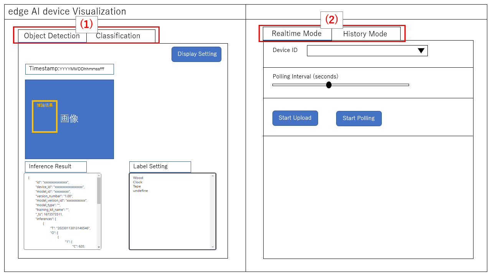
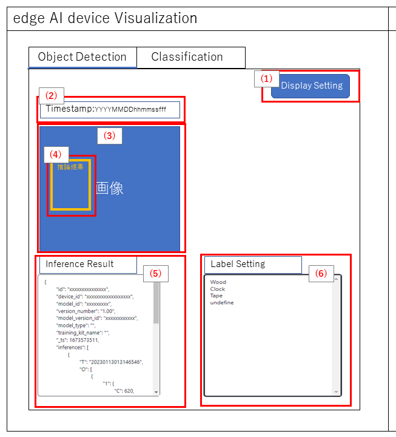
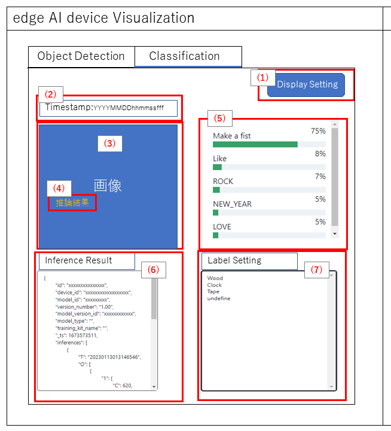

= Cloud SDK pass:[ ] Visualization pass:[ ] 機能仕様書 pass:[ ]
:sectnums:
:sectnumlevels: 1
:author: Copyright 2023 Sony Semiconductor Solutions Corporation
:version-label: Version 
:revnumber: x.x.x
:revdate: YYYY - MM - DD
:trademark-desc: AITRIOS™、およびそのロゴは、ソニーグループ株式会社またはその関連会社の登録商標または商標です。
:toc:
:toc-title: 目次
:toclevels: 1
:chapter-label:
:lang: ja

== 更新履歴

|===
|Date |What/Why

|2022/11/16
|初版作成

|2023/1/30
|UI刷新に向けての更新 + 
Classification対応 + 
PDFビルド環境更新

|===

== はじめに
* 本書は、推論結果を確認するためのVisualizationについての機能仕様である。機能開発言語には、TypeScriptを使用する。アプリケーションフレームワークはNext.jsを使用する。

== 用語・略語
|===
|Terms/Abbreviations |Meaning

|Console Access Library
|Console for AITRIOSへのアクセス方法を提供するSDK

|Console for AITRIOS (以下、Consoleと記載)
|エッジからクラウドを含めたソリューションを効率的に導入するための各種機能（デプロイメント機能、リトレーニング機能、エッジAIデバイスマネジメント機能など）を提供するクラウドサービス

|推論結果
|Vision and Sensing Applicationからの出力のうち、AI処理されたメタデータ

|画像
|Vision and Sensing Applicationからの出力のうち、エッジAIデバイスがとらえているイメージデータ
|===

== 参照資料
* Visualizationで利用するTypeScript版Console Access Library
** https://github.com/SonySemiconductorSolutions/aitrios-sdk-console-access-lib-ts

* Visualizationで利用する推論結果Deserializeサンプルコード
** https://github.com/SonySemiconductorSolutions/aitrios-sdk-deserialization-sample

* Next.js
** https://nextjs.org/

== 想定ユースケース
* ユーザーはリポジトリ内のVisualizationを起動することで、エッジAIデバイスがUploadした推論結果の確認ができる。

== 機能概要、アルゴリズム
[NOTE]
=== Functional Overview
* Realtime Mode
** 最新データを取得、表示できる。
** Start Uploadボタンを押下することで、推論元画像/推論結果のアップロードを開始する。
** Stop Uploadボタンを押下することで、推論元画像/推論結果のアップロードを停止する。
** Start Pollingボタンを押下することで、最新の推論元画像/推論結果の取得、画面表示を開始する。
*** 選択しているAI TaskがClassificationの場合は、推論結果一覧の表示も開始する。
** Stop Pollingボタンを押下することで、最新の推論元画像/推論結果の取得、画面表示を停止する。
*** 選択しているAI TaskがClassificationの場合は、推論結果一覧の表示も停止する。

* History Mode
** 指定したサブディレクトリに紐づく過去のデータを取得、表示できる。
** Start Playingボタンを押下することで、過去の推論元画像/推論結果の取得、画面表示を開始する。
*** 選択しているAI TaskがClassificationの場合は、推論結果一覧の表示も開始する。
** Stop Playingボタンを押下することで、過去の推論元画像/推論結果の取得、画面表示を停止する。
*** 選択しているAI TaskがClassificationの場合は、推論結果一覧の表示も停止する。

* Docker in Docker で動かすことができる。
* Codespaces で動かすことができる。
* ベースAIモデルはObject DetectionとClassificationのみ対応する。

=== Algorithm
. 画面を起動する。
.. メイン画面が表示される。
. getDeviceInfoが呼び出され、Consoleに登録されているエッジAIデバイスのDevice ID一覧を取得する。
. 取得したエッジAIデバイスのDevice ID一覧はドロップダウンリストに設定される。
. 推論結果の表示ラベル設定を行う。
. Display Settingメニューを開き、AI Taskタブ上の表示設定を行う。

. Realtime Modeの場合
.. 使用するエッジAIデバイスのDevice IDをDevice IDドロップダウンリストから選択し、Start Uploadを押下する。
.. startUploadInferenceResultが呼び出され、推論元画像と推論結果のアップロードが開始される。
.. Polling Intervalを設定し、Start Pollingボタンを押下する。
.. getImage、getInferenceが定期呼び出しされ、最新の推論元画像と推論結果を取得、表示する。
* 選択しているAI TaskがClassificationの場合は、推論結果一覧も表示する。
.. Stop Uploadボタンを押下すると、stopUploadInferenceResultが呼び出され、推論元画像と推論結果のアップロードが停止される。
.. Stop Pollingボタンを押下すると、最新の推論元画像と推論結果の取得、表示が停止される。
* 選択しているAI TaskがClassificationの場合は、推論結果一覧の表示も停止される。

. History Modeの場合
.. 使用するエッジAIデバイスのDevice IDをDevice IDドロップダウンリストから選択する。
.. getSubDirectoryListが呼び出され、推論元画像が保存されているサブディレクトリの一覧を取得する。
.. 取得したサブディレクトリの一覧はドロップダウンリストに設定される。
.. 使用するサブディレクトリをSub Directoryドロップダウンリストから選択する。
.. getTotalImageCountが呼び出され、選択したサブディレクトリに保存されている推論元画像の件数を取得する。
.. Image Selection/Interval Time を設定し、Start Playingを押下する。
.. getImage、getInferenceが定期呼び出しされ、サブディレクトリに保存されている推論元画像の件数分の推論元画像と推論結果を1件ずつ取得、表示する。
* サブディレクトリの最後の推論元画像と推論結果を取得、表示した後は、再度1件目の推論元画像と推論結果を取得する。
* 選択しているAI TaskがClassificationの場合は、推論結果一覧も表示する。
.. Stop Playingボタンを押下すると、推論元画像と推論結果の取得、表示が停止される。
* 選択しているAI TaskがClassificationの場合は、推論結果一覧の表示も停止される。

=== Under what condition
* Consoleへのアクセスができること。
* TypeScriptの開発環境が構築されていること。
** TypeScriptのversionは4.7。
** そのまま実行する場合に必要である。
* Dockerが利用可能であること。
** Dockerコンテナをビルドして利用する場合に必要である。
* エッジAIデバイスがConsoleに接続されており、Consoleからの操作を受けつける状態である。

=== API
* GET
** {base_url}/api/image/{deviceId}
** {base_url}/api/inference/{deviceId}
** {base_url}/api/subDirectoryList/{deviceId}
** {base_url}/api/totalImageCount/{deviceId}
** {base_url}/api/deviceInfo

* POST
** {base_url}/api/startUploadInferenceResult/{deviceId}
** {base_url}/api/stopUploadInferenceResult/{deviceId}

=== Others Exclusive conditions / specifications
* なし

== 操作性仕様、画面仕様
=== 画面仕様
:figure-caption: 図

[#_Overview]
==== 画面全体像

. AI Taskタブ
* *"Object Detection"* のタブと *"Classification"* のタブに分かれている
. Modeタブ
* *"Realtime Mode"* のタブと *"History Mode"* のタブに分かれている

==== Object Detectionタブ

. Display Settingメニュー
** AI Taskタブ上の表示設定を行う
. 画像ファイルのタイムスタンプ
. 推論元画像
. 推論結果
. 推論結果生データ
** JSON形式で表示される
. 推論結果の表示ラベル設定
** テキスト形式で表示される

==== Classificationタブ

. Display Settingメニュー
** AI Taskタブ上の表示設定を行う
. 画像ファイルのタイムスタンプ
. 推論元画像
. 推論結果
** Display SettingメニューのProbabilityスライダーに設定した境界値以上かつ、最も高いScoreの推論結果が表示される
** 最も高いScoreが同点の場合は、そのうちの一つ目が表示される
** Scoreが全て0%の場合は推論結果を表示しない
. 推論結果一覧
. 推論結果生データ
** JSON形式で表示される
. 推論結果の表示ラベル設定
** テキスト形式で表示される

==== Realtime Modeタブ
image::./ScreenSpec_Visualization_RealtimeMode.png[Realtime Modeタブ仕様, width="700"]

. Device IDドロップダウンリスト
** Consoleに登録されているエッジAIデバイスのDevice IDを選択する
. Polling Intervalスライダー
** Consoleからデータ取得する時のPolling間隔を設定するスライダー
** Polling間隔はスライダーの右横に数字で記載
. Start Upload/Stop Uploadボタン
** 画像と推論結果のアップロードを開始/停止する
. Start Polling/Stop Pollingボタン
** Consoleから最新の画像・推論結果の取得と、表示を開始/停止する

==== History Modeタブ
image::./ScreenSpec_Visualization_HistoryMode.png[History Modeタブ仕様, width="700"]

. Device IDドロップダウンリスト
** Consoleに登録されているエッジAIデバイスのDevice IDを選択する
. Sub Directoryドロップダウンリスト
** Consoleに格納されている画像のSub Directoryを選択する
. Image Selectionスライダー
** 表示開始する推論元画像のインデックスを設定する
** インデックスはスライダーの右横に数字で記載
** スライダーの値を変更した際は、推論元画像の日時のみインデックスに紐づくものに更新される
. Interval Timeスライダー
** 推論元画像を切り替える時のPlaying間隔を設定する
** Playing間隔はスライダーの右横に数字で記載
. Start Playing/Stop Playingボタン
** 推論元画像切り替えを開始/停止する

==== Display Settingメニュー(Object Detectionタブ)
image::./ScreenSpec_Visualization_SettingMenu_ObjectDetection.png[Display Settingメニュー(Object Detectionタブ)仕様]

. Display Settingメニューを閉じるボタン
. Probabilityスライダー
** AI Taskタブ上に表示する確信度の境界値を調整する
** 境界値はスライダーの右横に%で記載
. Display Timestampボタン
** 画像ファイルのタイムスタンプの表示/非表示を設定する

==== Display Settingメニュー(Classificationタブ)
image::./ScreenSpec_Visualization_SettingMenu_Classification.png[Display Settingメニュー(Classificationタブ)仕様]

* 1～3はObject DetectionタブのDisplay Settingメニューと同様

[start=4]
. Display Top Scoreドロップダウンリスト
** 推論結果一覧に表示する件数を選択する
** 最大値は20とする
. Overlay Inference Resultボタン
** 推論結果のScoreが最も高い情報の表示/非表示を設定する
** Classificationタブの推論結果の表示に紐づく
. Overlay Inference Result Colorボタン
** 推論結果のScoreが最も高い情報の表示色を設定する
** カラーピッカーから任意の色を選択する

=== 操作性仕様
==== Visualization起動までの操作
* リポジトリをcloneして使う
. 開発者は任意のブラウザからVisualizationのリポジトリを開き、リポジトリをCloneする。
. CloneしたVisualizationに必要なパッケージをインストールする。
. Visualizationを起動する。

* Dockerコンテナをビルドして使う
. 利用者は任意のブラウザからVisualizationのリポジトリを開き、リポジトリをCloneする。
. リポジトリ内のDockerfileに対し、下記コマンドを実行することでVisualizationを起動する。
+
....
docker build
....

==== Visualization起動後の操作
. Visualization起動後はメイン画面に遷移する。
. AI Taskタブから [**Object Detection**]/[**Classification**] のうち、任意のタブを指定する。
. Modeタブから [**Realtime Mode**]/[**History Mode**] のうち、任意のモードを指定する。

. AI Taskの選択
[#_AI Task-operation]
.. Object Detectionタブの場合
... [**Display Setting**]メニューを開いて、[**Probability**]スライダー/[**Display Timestamp**] を設定する。
* Polling/Playing中でも[**Probability**]スライダー は機能する。
* 推論元画像が表示されていれば、停止中でも機能する。
... 推論結果の表示ラベル設定を変更する。
... Modeタブの操作により、画像ファイルのタイムスタンプ/推論元画像/推論結果/推論結果生データ が表示される。
** 推論結果は推論元画像の上に、推論結果の表示ラベル設定で設定したラベル名と共に枠で表示される。

.. Classificationタブの場合
... [**Display Setting**]メニューを開いて、[**Probability**]スライダー/[**Display Timestamp**]ボタン/[**Display Top Score**]ドロップダウンリスト/[**Overlay Inference Result**]ボタン/[**Overlay Inference Result Color**]ボタン を設定する。
* Polling/Playing中でも[**Probability**]スライダー は機能する。
* 推論元画像が表示されていれば、停止中でも機能する。
... 推論結果の表示ラベル設定を変更する。
... Modeタブの操作により、画像ファイルのタイムスタンプ/推論元画像/推論結果/推論結果一覧/推論結果生データが表示される。

. Modeの選択
[#_Mode-operation]
.. Realtime Modeタブの場合
... [**Device ID**]ドロップダウンリスト/[**Polling Interval**]スライダー を設定し、[**Start Upload**]ボタン 押下後に [**Start Polling**] ボタンを押下する。
** Polling中は[**Device ID**]ドロップダウンリスト/[**Polling Interval**]スライダー は機能しない。
... 指定した推論元画像/推論結果の取得が開始され、AI Taskタブ上に表示される。
... [**Stop Polling**]ボタン押下後、[**Stop Upload**]ボタンを押下する。
** Polling中に[**Stop Polling**]ボタンを押下するとPollingのみが停止されるが、Polling中に[**Stop Upload**]ボタンを押下すると、UploadとPollingの両方が停止される。

.. History Modeタブの場合
... [**Device ID**]ドロップダウンリスト/[**Sub Directory**]ドロップダウンリスト/[**Image Selection**]スライダー/[**Interval Time**]スライダー を設定し、[**Start Playing**]ボタンを押下する。
** Playing中は[**Device ID**]ドロップダウンリスト/[**Sub Directory**]ドロップダウンリスト/[**Image Selection**]スライダー/[**Interval Time**]スライダー は機能しない。
** Stop Playing中に [**Image Selection**]スライダー の値を変更しても推論元画像は切り替わらない。
... 指定した推論元画像/推論結果の取得が開始され、AI Taskタブ上に表示される。
... [**Stop Playing**]ボタンを押下する。

=== 各BlockでのAPIパラメータ
==== GET

* getImage +
URL：{base_url}/api/image/{deviceId}?{imagePath}&{numberOfImages}&{skip}&{orderBy}
** 指定したimagePathの画像を取得し返却する。

|===
|Query Parameter's name|Meaning|Range of parameter

|deviceId
|推論元画像をUploadしているエッジAIデバイスのDevice ID
|指定なし

|imagePath
|取得したい推論元画像のクラウドストレージ上のPath
|指定なし

|numberOfImages
|推論元画像の取得件数
|指定なし

|skip
|取得をスキップする推論元画像の件数
|指定なし

|orderBy
|推論元画像が作成された日時によるソート順
|ASC、DESC
|===

|===
|Return value|Meaning

|buff
|取得した推論元画像のバイナリデータ

|timestamp
|取得した推論元画像のタイムスタンプ
|===

* getInference +
URL : {base_url}/api/inference/{deviceId}?{timestamp}&{aiTask}
** 画像に紐づく推論結果リストを取得し返却する。
*** 当API内で推論結果のデシリアライズも行う

|===
|Query Parameter's name|Meaning|Range of parameter

|deviceId
|推論結果をUploadしているエッジAIデバイスのDevice ID
|指定なし

|timestamp
|推論元画像の保存時に取得したタイムスタンプ
|指定なし

|aiTask
|選択しているAI Taskの種類
|ObjectDetection、Classification
|===

|===
|Return value|Meaning

|inferences list
|推論元画像に紐づく推論結果のリスト
|===

* getSubDirectoryList +
URL : {base_url}/api/subDirectoryList/{deviceId}
** 推論元画像が保存されているサブディレクトリのリストを取得し返却する。

|===
|Query Parameter's name|Meaning|Range of parameter

|deviceId
|推論元画像をUploadしているエッジAIデバイスのDevice ID
|指定なし
|===

|===
|Return value|Meaning

|subDirectory list
|推論元画像が保存されているサブディレクトリのリスト
|===

* getTotalImageCount +
URL : {base_url}/api/totalImageCount/{deviceId}?{subDirectory}
** 選択したサブディレクトリに保存されている推論元画像の件数を取得し返却する。

|===
|Query Parameter's name|Meaning|Range of parameter

|deviceId
|推論元画像をUploadしているエッジAIデバイスのDevice ID
|指定なし

|subDirectory
|サブディレクトリ一覧から選択したサブディレクトリ
|指定なし
|===

|===
|Return value|Meaning

|total image count
|選択したサブディレクトリに保存されている推論元画像の件数
|===

* getDeviceInfo +
URL : {base_url}/api/deviceInfo
** Consoleに登録されているエッジAIデバイスのDevice ID一覧を取得する。

|===
|Query Parameter's name|Meaning|Range of parameter

|なし
|
|
|===

|===
|Return value|Meaning

|device list
|エッジAIデバイスのDevice ID一覧
|===

==== POST
* startUploadInferenceResult +
URL : {base_url}/api/startUploadInferenceResult/{deviceId}
** 選択したエッジAIデバイスのDevice IDに対して、推論結果と推論元画像のUpload開始を要求する。
*** 当API内でCommand Parameter Fileの一覧取得も行う

|===
|Query Parameter's name|Meaning|Range of parameter

|deviceId
|推論元画像と推論結果をUploadするエッジAIデバイスのDevice ID
|指定なし
|===

|===
|Return value|Meaning

|result
|SUCCESSかERRORの文字列

|outputSubDir
|画像がアップロードされるディレクトリ
|===

* stopUploadInferenceResult +
URL : {base_url}/api/stopUploadInferenceResult/{deviceId}
** 選択したエッジAIデバイスのDevice IDに対して、推論結果と画像のUpload停止を要求する。

|===
|Query Parameter's name|Meaning|Range of parameter

|deviceId
|推論元画像と推論結果のUploadを停止するエッジAIデバイスのDevice ID
|指定なし
|===

|===
|Return value|Meaning

|result
|SUCCESSかERRORの文字列
|===

== 目標性能
* UIの応答時間が1.2秒以内であること。
* 処理に5秒以上かかる場合は、処理中の表現を逐次更新表示できること。

== 制限事項
* 今回はAI TaskはObject DetectionとClassificationのみの対応とする。
* 推論結果の表示ラベル設定はテキスト形式で行うこととする（下記を参考とする）。

   Label_1
   Label_2
   Label_3

* Console UIから、Command Parameter Fileを下記の設定にしておく。
** Mode=1(Image&Inference Result)
** UploadMethodIR="Mqtt"
* 実行時にAIモデルやアプリケーションがデプロイされていないエッジAIデバイスを選択した場合、正常に動作しない。
* データ取得時のAIモデルと異なるAI Taskを選択した場合、エラーまたは不正なデータとなる場合がある。

== その他特記事項
* エッジAIデバイスからConsoleへの画像アップロード時に、最大数分程度の遅延が発生することがある。

== 未決定事項
* なし
