= Cloud SDK pass:[ ] Visualization pass:[ ] チュートリアル pass:[ ] 
:sectnums:
:sectnumlevels: 1
:author: Copyright 2023 Sony Semiconductor Solutions Corporation
:version-label: Version 
:revnumber: x.x.x
:revdate: YYYY - MM - DD
:trademark-desc: AITRIOS™、およびそのロゴは、ソニーグループ株式会社またはその関連会社の登録商標または商標です。
:toc:
:toc-title: 目次
:toclevels: 1
:chapter-label:
:lang: ja

== 更新履歴

|===
|Date |What/Why 

|2022/11/16
|初版作成

|2023/1/30
|「**Cloud SDK**」の0.2.0に対応

|2023/5/26
|ローカル保存対応 +
Semantic Segmentation追加対応 +
クライアントIDとシークレット取得方法追加対応 +
VS Code拡張機能の名称変更対応 +
ツール名の括弧の表記を修正 +
デバイスID選択をデバイス名選択へ変更する対応 +
DockerBuild対応 +
サブディレクトリ内画像が1枚の場合の文言変更 +
画像数によって再生順が乱れる旨を追加

|2023/7/5
|カスタマイズ方法を追加

|===

== はじめに
このチュートリアルでは、「**Visualization**」の利用方法について解説します。 +
「**Visualization**」は、エッジAIデバイスが「**Console**」へアップロードした推論結果を確認するために用意しています。

[#_precondition]
== 前提条件
=== 接続情報
「**Visualization**」を使用するには、「**Console**」へアクセスするための接続情報が必要になります。 +
取得した情報は<<#_Execute_visualization,「Visualization」使用方法>>で利用します。 +
必要な接続情報は下記の通りです。

* クライアントアプリ詳細情報
** 「**Portal for AITRIOS**」のクライアントアプリ一覧から参照または、必要に応じてサンプルアプリケーション向けのクライアントアプリ登録を行い、下記情報の取得を行ってください。
詳細は、 https://developer.aitrios.sony-semicon.com/file/download/portal-user-manual[「**Portalユーザーマニュアル**」] の「SDK用のClient Secretを発行する」をお読みください。
*** クライアントID
*** シークレット
+
** https://developer.aitrios.sony-semicon.com/file/download/rest-api-authentication[こちらのドキュメント] から下記の情報を取得してください。
*** コンソールエンドポイント
*** ポータル認証エンドポイント

=== エッジAIデバイス
「**Visualization**」を正常に動作させるためには、利用するエッジAIデバイスに特定の設定が必要になります。 +
必要な設定内容は下記の通りです。

* AIモデルやアプリケーションがデプロイされていること
* ベースAIモデルに、Object Detectionまたは、Classification、Semantic SegmentationのAIモデルがデプロイされていること
* 「**Console**」のUIから、利用するCommand Parameter Fileを下記の設定にしておくこと
+

** Mode=1(Image&Inference Result) 
** UploadMethodIR="Mqtt" 
** AIモデルやアプリケーションの内容に応じて、その他のパラメータも変更する必要がある

== 機能概要
「**Visualization**」では、「**Console**」に登録されたエッジAIデバイスを指定し、推論結果と画像を取得する機能を実装しています。 +
動作モードが二種類あり、最新の推論結果を取得するRealtime Modeと、過去の推論結果を取得するHistory Modeを利用できます。

== 動作環境
「**Visualization**」は下記のいずれかの環境で動作させることができます。

* GitHub Codespaces(以下Codespaces)環境
* Visual Studio Code(以下VS Code)とDockerを利用したDev Container環境
* Dockerコンテナ
* Node.js環境

== 環境セットアップ

Codespaces、VS Codeおよび、Dockerのセットアップについては https://developer.aitrios.sony-semicon.com/en/downloads#sdk-getting-started[「**SDK スタートガイド**」] を参照してください。 +
お使いのPC上にNode.js環境をセットアップして実行する場合は、下記の手順を参照してください。

=== Node.js環境をセットアップする

. Node.jsをインストールする +
お使いの環境向けのインストーラを https://nodejs.org/ja/download/[公式サイト] から取得し、インストールしてください。 +
+
IMPORTANT: Node.jsのバージョンはv16を使用してください。

. リポジトリをCloneする +
任意のディレクトリに「**Visualization**」のリポジトリをCloneします。gitコマンドを利用する場合は、下記のコマンドを実行してサブモジュールを含むリポジトリをCloneできます。
+
[source,Bash]
----
git clone --recursive https://github.com/SonySemiconductorSolutions/aitrios-sdk-visualization-ts.git
----
+
その他のClone方法については、 https://docs.github.com/ja/repositories/creating-and-managing-repositories/cloning-a-repository[GitHub Docs] を参照してください。

[#_Execute_visualization]
== 「**Visualization**」使用方法

<<#_precondition,前提条件>>で用意した接続情報を使用します。

=== 接続情報を設定する
. Codespacesまたは、リポジトリをCloneした環境上で [src/common]配下に[console_access_settings.yaml]を作成し接続先情報を設定します。

+
|===
|src/common/console_access_settings.yaml
a|
[source,Yaml]
----
console_access_settings:
  console_endpoint: "コンソールエンドポイント"
  portal_authorization_endpoint: "ポータル認証エンドポイント"
  client_secret: "シークレット"
  client_id: "クライアントID"
----
|===
+
* `**console_endpoint**` に、コンソールエンドポイントを指定します。 +
* `**portal_authorization_endpoint**` に、ポータル認証エンドポイントを指定します。 +
* `**client_secret**` に、登録したアプリケーションのシークレットを指定します。 +
* `**client_id**` に、登録したアプリケーションのクライアントIDを指定します。 +
+

IMPORTANT: クライアントIDとシークレットの取得方法詳細は、 https://developer.aitrios.sony-semicon.com/file/download/portal-user-manual[「**Portalユーザーマニュアル**」] の「SDK用のClient Secretを発行する」をお読みください。 + 
コンソールエンドポイントとポータル認証エンドポイントの取得方法詳細は、link:++https://developer.aitrios.sony-semicon.com/file/download/rest-api-authentication++[こちらのドキュメント] をお読みください。 +
これらは「**Console**」へのアクセス情報となります。 + 
公開したり、他者との共有をせず、取り扱いには十分注意してください。
+
NOTE: Proxy環境で「**Visualization**」を実行する場合、環境変数 `**https_proxy**` の設定をしてください。

=== 「**Visualization**」を起動する

==== Dockerコンテナでの起動方法

. リポジトリをCloneしたディレクトリでターミナルを起動する

. ターミナルで下記のコマンドを実行する
+
[source,Bash]
----
docker build . -t visualization-app
docker run -p 3000:3000 -d visualization-app
----
NOTE: ポート番号 3000 が既に使用されている場合は、 "failed: port is already allocated."のエラーが発生し起動できません。
コマンドの 3000 の部分を使用していないポート番号に変更してください。

. コンテナ起動後に接続情報を変更したい場合は、接続情報の変更後に下記コマンドを実行してください。
+
[source,Bash]
----
docker cp src/common/console_access_settings.yaml {コンテナ名}:/app/src/common/console_access_settings.yaml
----

==== それ以外の環境での起動方法
. Codespacesまたは、「**Visualization**」のリポジトリをCloneしたディレクトリでターミナルを起動する
. 下記コマンドを実行して、Cloneした「**Visualization**」に必要なパッケージをインストールする。(Codespacesの場合は自動インストールされるため、不要)
+
[source,Bash]
----
npm install
----
NOTE: 上記コマンド実行時に「npm ERR! gyp ERR! build error」というエラーが発生した場合は、C++コンパイラをインストールしてください。

. ターミナルで下記のコマンドを実行し、「**Visualization**」を起動する。 +
+
[source,Bash]
----
npm run dev
----

=== 「**Visualization**」を操作する
ブラウザから「**Visualization**」にアクセスして、各種操作を行います。

. ブラウザで http://localhost:3000 (Codespacesの場合は、ポート転送されたURL)を開く

NOTE: 起動時にポート番号を変更している場合はアクセスできません。
URLの 3000 の部分を変更したポート番号に置き換えてください。

. 対象のAIモデルを指定する +
画面左上のタブを選択することで、AIモデルにあわせた表示モードの切り替えができます。 +
Object Detection向けの表示項目の確認は<<#_ObjectDetection,「Object Detectionの表示項目」>>へ進んでください。 +
Classification向けの表示項目の確認は<<#_Classification,「Classificationの表示項目」>>へ進んでください。 +
Semantic Segmentation向けの表示項目の確認は<<#_Segmentation,「Segmentationの表示項目」>>へ進んでください。 +

. 表示項目のパラメータを指定する +
推論結果・TimeStampなどの表示項目を設定できます。 +
画像表示の設定を行う場合は、<<#_DisPlaySetting,「画像表示の設定を変更する」>>へ進んでください。 + 

. 動作モードを指定する +
画面右上のタブを選択することで、動作モードの切り替えができます。 +
最新の推論結果を取得する場合は、<<#_RealtimeMode,「最新の画像/推論結果を確認する」>>へ進んでください。 + 
過去の推論結果を取得する場合は、<<#_HistoryMode,「過去の画像/推論結果を確認する」>>へ進んでください。

. データを保存する +
画像と推論結果、画像に推論結果を合わせた重ね合わせ画像としてローカルに保存することができます。 +
データを保存する場合は、<<#_SaveData,「データを保存する」>>へ進んでください。 + 

[#_ObjectDetection]
==== Object Detectionの表示項目
* 画面左側上部の[**Object Detection**]タブを選択する +
[**Object Detection**]タブを選択することで、Object DetectionのAIモデルを利用した推論結果を表示させることができます。
+
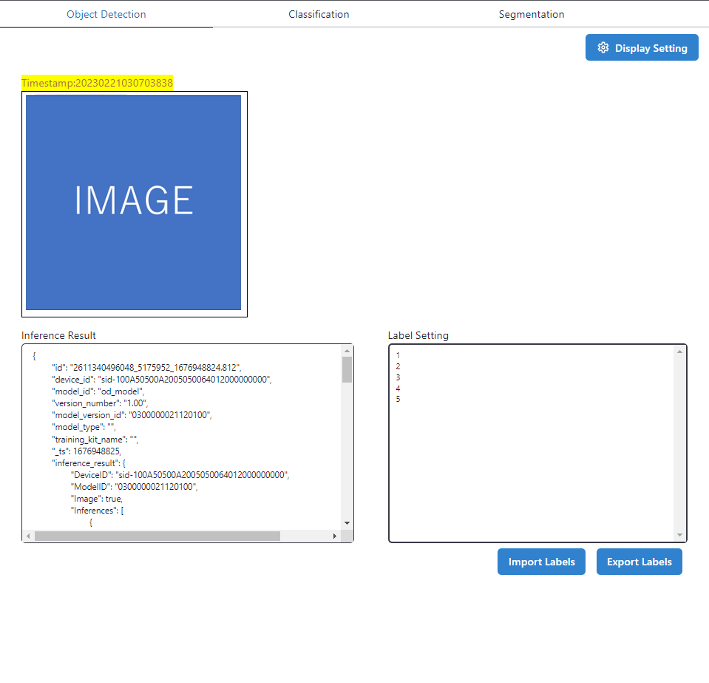
各表示パーツの機能は下記のとおりです。
+
|===
|表示パーツ |機能説明 

|画面上部の[**Display Setting**]ボタン
|推論結果の表示設定ダイアログを起動します。

|画面上半分の画像表示エリア
|エッジAIデバイスで撮影した画像と推論結果の重畳表示を行います。

|画面下側の[**Inference Result**]
|「**Console**」から取得した推論結果の生データが表示されます。
|画面下側の[**Label Setting**]
|推論結果の表示に利用するラベルのリスト表示および、編集を行うことができます。
|画面下側の[**Import Labels**]
|ローカルに保存されているラベルファイルを読み込み表示します。
|画面下側の[**Export Labels**]
|表示されているラベル情報をローカルに保存します。 + 
ラベル名の編集方法については、<<#_Label-setting,「表示ラベルの設定を変更する」>>を参照してください。
|===
+

[#_Classification]
==== Classificationの表示項目
* 画面左側上部の[**Classification**]タブを選択する +
[**Classification**]タブを選択することで、ClassificationのAIモデルを利用した推論結果を表示させることができます。
+
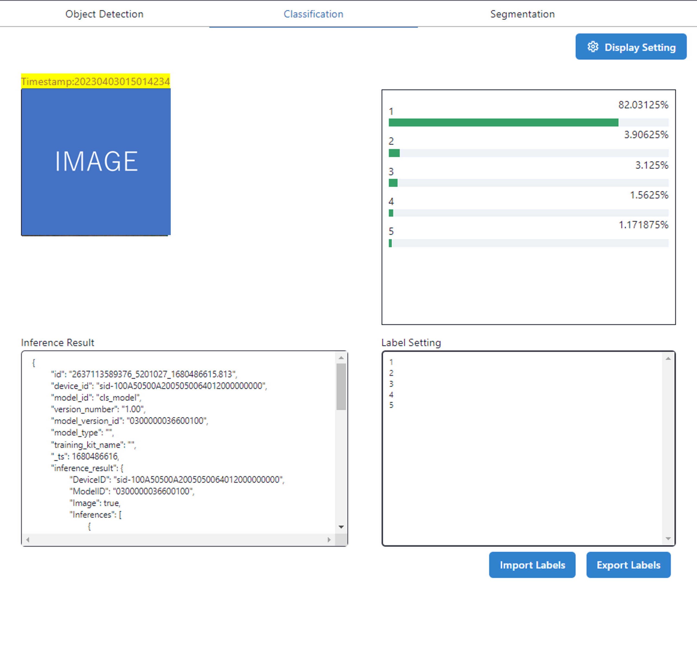
各表示パーツの機能は下記のとおりです。
+
|===
|表示パーツ |機能説明 

|画面上部の[**Display Setting**]ボタン
|推論結果の表示設定ダイアログを起動します。

|画面上半分の画像表示エリア
|エッジAIデバイスで撮影した画像と推論結果の重畳表示を行います。
右側のリストに識別中のラベルがスコアと共に表示されます。

|画面下側の[**Inference Result**]
|「**Console**」から取得した推論結果の生データが表示されます。
|画面下側の[**Label Setting**]
|推論結果の表示に利用するラベルのリスト表示および、編集を行うことができます。
|画面下側の[**Import Labels**]
|ローカルに保存されているラベルファイルを読み込み表示します。
|画面下側の[**Export Labels**]
|表示されているラベル情報をローカルに保存します。  +
ラベル名の編集方法については、<<#_Label-setting,「表示ラベルの設定を変更する」>>を参照してください。
|===
+
[NOTE]
====
表示対象の推論結果がObject DetectionのAIモデルで作成されたものだった場合、推論結果のスコア表示が異常値になります。 +
その場合はAI Taskを[**Classification**]に設定してください。
====

[#_Segmentation]
==== Segmentationの表示項目
* 画面左側上部の[**Segmentation**]タブを選択する +
[**Segmentation**]タブを選択することで、Semantic SegmentationのAIモデルを利用した推論結果を表示させることができます。
+
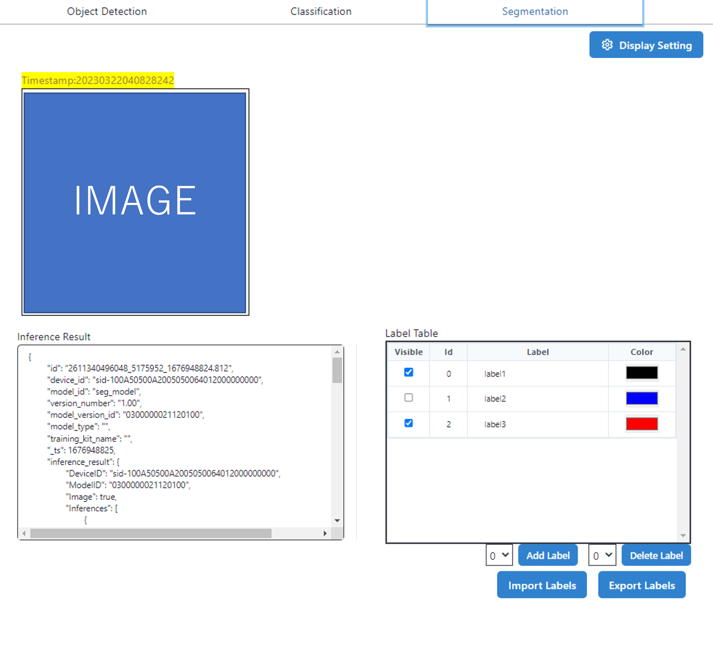
各表示パーツの機能は下記のとおりです。
+
|===
|表示パーツ |機能説明 

|画面上部の[**Display Setting**]ボタン
|推論結果の表示設定ダイアログを起動します。

|画面上半分の画像表示エリア
|エッジAIデバイスで撮影した画像と推論結果の重畳表示を行います。
右側のリストに識別中のラベルがスコアと共に表示されます。
|画面下側の[**Inference Result**]
|「**Console**」から取得した推論結果の生データが表示されます。
|画面下側の[**Label Table**]
|推論結果の表示に利用するラベルテーブルの表示します。 +
|[**Label Table**]の[**Visible**]
|ラベルの表示/非表示の切り替えができます。
|[**Label Table**]の[**Id**]
|ラベルのクラスIDを表示します。
|[**Label Table**]の[**Label**]
|ラベル名の表示および、編集を行うことができます。
|[**Label Table**]の[**Color**]
|推論結果の色の表示および、変更ができます。  +
|画面下側の[**Add Label**]ドロップダウン
|ラベルテーブルにラベルを追加する際の位置を指定できます。 +
設定範囲は0～ラベルテーブルの最終ID+1、最大値はラベルテーブルの最終ID+1の範囲で指定できます。
|画面下側の[**Add Label**]ボタン
|左のドロップダウンで選択した位置にラベルを追加します。
|画面下側の[**Delete Label**]ドロップダウン
|ラベルテーブル内のラベルを削除する際の位置を指定できます。 +
設定範囲は0～ラベルテーブルの最終ID、最大値はラベルテーブルの最終IDの範囲で指定できます。
|画面下側の[**Delete Label**]ボタン
|左のドロップダウンで選択した位置のラベルを削除します。
|画面下側の[**Import Labels**]
|ローカルに保存されているラベルファイルを読み込み表示します。
|画面下側の[**Export Labels**]
|表示されているラベル情報をローカルに保存します。  +
ラベル名の編集方法については、<<#_Label-setting,「表示ラベルの設定を変更する」>>を参照してください。
|===

[#_DisPlaySetting]
=== 画像表示の設定を変更する
==== Display Settingで表示の設定を行う +
. 画面上部にある[**Display Setting**]ボタンをクリックすることで表示設定ダイアログが表示されます。 +
. 各パラメータを変更することで画像表示エリアの表示の設定ができます。 +
[**Classification**]とその他のAI Taskでは表示される項目が異なります。 +

* [**Object Detection**]の場合
+ 
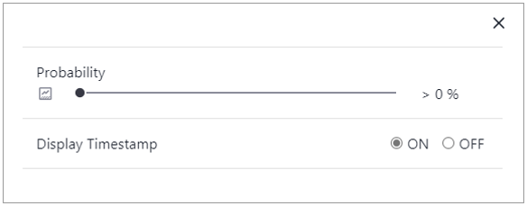
+ 
各パラメータの意味は下記の通りです。
+ 
|===
|パラメータ名 |意味 

|[**Probability**]スライダー
|表示する確信度の境界値を調整します。

|[**Display Timestamp**]ボタン
|画像ファイルのタイムスタンプ表示/非表示を設定します。
|===

* [**Classification**]の場合
+ 
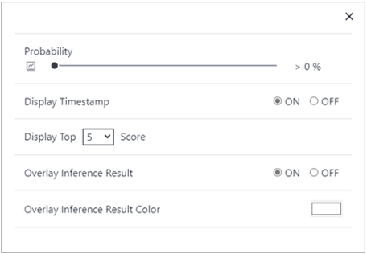
+ 
各パラメータの意味は下記の通りです。
+ 
|===
|パラメータ名 |意味 

|[**Probability**]スライダー
|表示する確信度の境界値を調整します。

|[**Display Timestamp**]ボタン
|画像ファイルのタイムスタンプ表示/非表示を設定します。

|[**Display Top Score**]ドロップダウンリスト
|推論結果一覧に表示する件数を選択します。

|[**Overlay Inference Result**]ボタン
|推論結果のScoreが最も高い情報の表示/非表示を設定します。

|[**Overlay Inference Result Color**]ボタン
|推論結果のScoreが最も高い情報の表示色を設定します。
|===

* [**Segmentation**]の場合
+ 
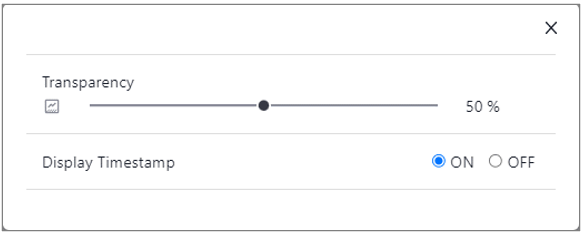
+
各パラメータの意味は下記の通りです。
+ 
|===
|パラメータ名 |意味 

|[**Transparency**]スライダー
|表示する推論結果の透明度を設定します。

|[**Display Timestamp**]ボタン
|画像ファイルのタイムスタンプ表示/非表示を設定します。
|===

[#_Label-setting]
==== 表示ラベルの設定を変更する
画像上に表示するラベルを変更するには、[**Label Setting**]のテキストボックスおよび、[**Label Table**]の内容を直接編集するか、[**Import Labels**]からラベルファイル(json)を読み込むことで設定できます。 

* テキストボックスから直接編集する +
ラベルはAIモデルが識別するクラスID順に書き込みます。 +
[**Object Detection**]と[**Classification**]の場合、改行区切りでラベルを設定することができます。 
+
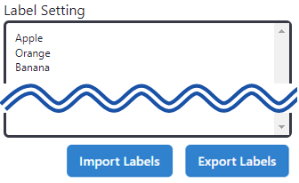
+
[**Segmentation**]の場合、ラベルの表示/非表示、ラベル名の変更、ラベルの色指定を設定することができます。 +
+
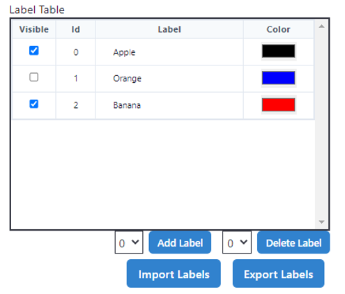
+

上記の画像は、クラスIDを"Apple"、"Orange"、"Banana"に設定しています。 +

* ラベルファイル(json)を読み込む +
[**Import Labels**]のボタンを押下し、ローカルに保存されているラベルファイル(json)を読み込みます。 +
[**Segmentation**]とその他のAI Taskではラベルファイルのフォーマットが異なります。 +
ラベルファイル(json)のフォーマットは下記を参考にしてください。 +
+
|===
|[**Object Detection**]/[**Classification**]の場合(json)
a|
[source,json]
----
{
  "label": [
    "Apple",
    "Orange",
    "Banana"
  ]
}
----
|=== 
+
|===
|[**Segmentation**]の場合(json)
a|
[source,json]
----
{
   "labelList": [
      {
        "isVisible": true
        "label": "Apple"
        "color": "#000000"
      },
      {
        "isVisible": false
        "label": "Orange"
        "color": "#0000ff"
      },
      {
        "isVisible": true
        "label": "Banana"
        "color": "#ff0000"
      }
   ]
}
----
|=== 
+
上記の場合は、クラスIDを"Apple"、"Orange"、"Banana"に設定しています。

[#_RealtimeMode]
=== 最新の画像/推論結果を確認する
Realtime Modeでは、最新の推論結果と画像を確認できます。

. 画面右側上部の[**Realtime Mode**]タブを選択する +
. 実行時のパラメータを設定する +
Realtime Modeを選択すると画面右側が下記の内容に切り替わります。 +
+
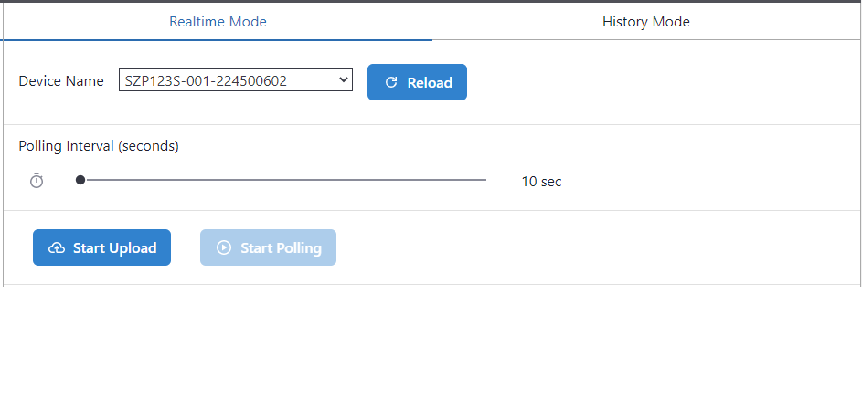
+
各パラメータの意味は下記の通りです。
+
|===
|パラメータ名 |意味 

|[**Device Name**]ドロップダウンリスト
|「**Console**」に登録されているエッジAIデバイスのDevice Nameを選択する

|[**Reload**]ボタン
|Device Nameリストを最新化する +
ボタン押下後、[**Device Name**]が未選択の状態にする

|[**Polling Interval**]スライダー
|「**Console**」からデータ取得する時のPolling間隔を設定する +
Polling間隔はスライダーの右横に数字で記載する

|[**Start Upload**]/[**Stop Upload**]ボタン
|画像と推論結果のアップロードを開始/停止する

|[**Start Polling**]/[**Stop Polling**]ボタン
|「**Console**」から最新の画像・推論結果の取得と、表示を開始/停止する

|===
+

. エッジAIデバイスに推論開始を指示する +
[**Start Upload**]を押下すると、エッジAIデバイスに推論開始を指示することができます。 +
推論が開始されると、エッジAIデバイスから「**Console**」に画像と推論結果のアップロードが開始されます。

. 推論結果の表示更新を開始する +
[**Start Polling**]を押下すると、画面左側に「**Console**」にアップロードされた画像と推論結果が表示されます。 +
[**Polling Interval**]で設定した周期で、最新の画像と推論結果を取得して表示を更新します。

. 推論結果の表示更新を停止する +
[**Stop Polling**]を押下すると、表示更新と「**Console**」からの画像と推論結果の取得を停止します。

. エッジAIデバイスに推論停止を指示する +
[**Stop Upload**]を押下すると、エッジAIデバイスに推論停止を指示することができます。 +
推論が停止すると、エッジAIデバイスから「**Console**」への画像と推論結果のアップロードも停止します。
+
[NOTE]
====
[**Stop Upload**]ボタンを押下すると、推論結果のアップロードと表示更新の両方が停止されます。
====

[#_HistoryMode]
=== 過去の画像/推論結果を確認する
History Modeでは、過去に保存された推論結果と画像を確認できます。 +

. 画面右側上部の[**History Mode**]タブを選択する +
. 実行時のパラメータを設定する +
History Modeを選択すると画面右側が下記の内容に切り替わります。  +
+
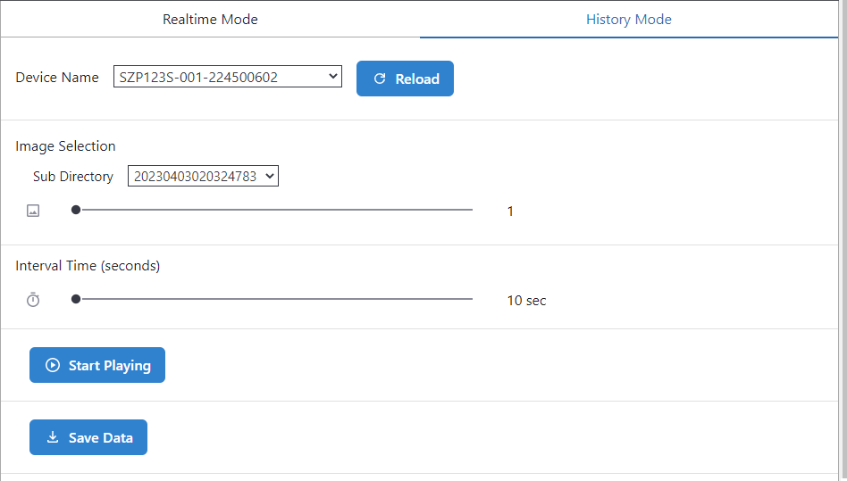
+
各パラメータの意味は下記の通りです。
+
|===
|パラメータ名 |意味 

|[**Device Name**]ドロップダウンリスト
|「**Console**」に登録されているエッジAIデバイスのDevice Nameを選択する

|[**Reload**]ボタン
|Device Nameリストを最新化する +
ボタン押下後、[**Device Name**]が未選択の状態にする

|[**Image Selection**]スライダー
|表示開始する推論元画像のインデックスを設定する +
インデックスはスライダーの右横に数字で記載する +
スライダーの値を変更した際は、推論元画像の日時のみインデックスに紐づくものに更新される

|[**Sub Directory**]ドロップダウンリスト
|「**Console**」に格納されている画像のSub Directoryを選択する

|[**Interval Time**]スライダー
|推論元画像を切り替える時のPlaying間隔を設定する +
Playing間隔はスライダーの右横に数字で記載する

|[**Start Playing**]/[**Stop Playing**]ボタン
|推論元画像切り替えを開始/停止する

|[**Save Data**]ボタン
|Save Dataメニューを表示する
|===
+

. 推論結果の表示を開始する +
[**Start Playing**]を押下すると、[**Sub Directory**]に格納されている画像と推論結果が画面左側に表示されます。 +
表示は、[**Image Selection**]で設定したインデックスから[**Interval Time**]の間隔で順次更新されます。 +
. 推論結果の表示を停止する +
[**Stop Playing**]を押下すると、表示の更新を停止します。 +

[#_SaveData]
=== データを保存する 
. [**History Mode**]の[**Save Data**]ボタンを押下するとSave Dataメニューが表示されます。 +
[**Save Data**]ボタンは[**Device Name**]と[**Sub Directory**]を指定することで押下することができます。
+
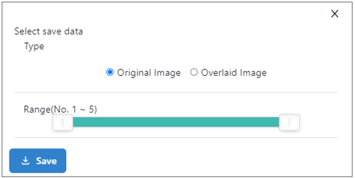
+
各パラメータの意味は下記の通りです。
+
|===
|パラメータ名 |意味 

|[**Type**]ラジオボタン
|画像の保存形式を選択できます。 +
[**Original Image**]に設定すると画像と推論結果を保存することができます。 +
[**Overlaid Image**]も設定すると画像、推論結果、表示設定を重ね合わせた画像と推論結果を保存することができます。 +

|[**Range**]スライダー
|データを保存する範囲を設定できます。 +
|[**Save**]ボタン
|押下するとファイル保存ダイアログが表示されます。 +
任意の保存先を指定することで保存処理が開始されます。 +
|===
. 各パラメータを設定して[**Save**]ボタンを押下します。
. 保存先を設定して[**保存**]ボタンを押下して保存処理を開始されます。
. 保存処理中は進捗バーが表示されます。 +
. 保存処理が完了すると、指定した保存先にデータが保存されます。

== 「**Visualization**」カスタマイズ方法
「**Visualization**」をカスタマイズすることで、自作したAIモデルとWasmを利用した推論結果を可視化することができます。 +
カスタマイズの手順については、link:CloudSDK_CustomizeGuideline_Visualization_ja.adoc[**「Cloud SDK Visualization カスタマイズガイドライン」**]を参照してください。

== 制限事項
*  環境によっては、ラベル名に半角英数字以外を設定すると、画像保存時に文字化けする可能性があります。
* History ModeやRealtime Modeにおいてサブディレクトリに1000枚を超えるデータが存在する場合、画像の再生順が乱れる可能性があります。

=== 「**Visualization**」が対応しているベースAIモデルについて
サポートしているベースAIモデルはObject Detection, Classification, Semantic Segmentationとなります。
